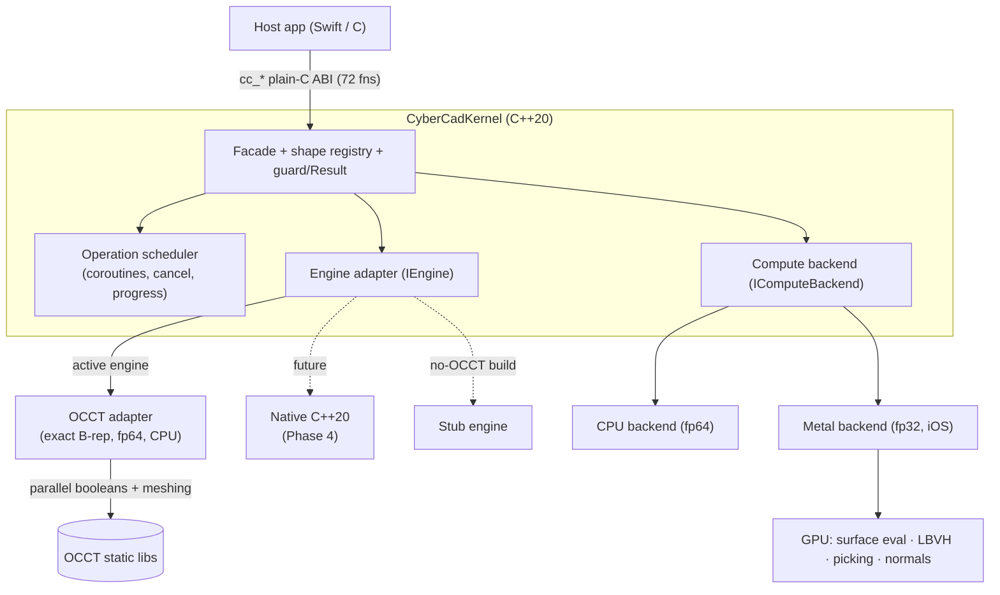

# CyberCadKernel

A portable, modern **C++20 geometry kernel** for precision CAD — built to power
[CyberCad](https://github.com/CyberdyneCorp) (iPadOS-first) and future
desktop/Android targets.

It lives behind a **stable plain-C ABI** (`cc_*`) and follows a
**wrap → accelerate → rewrite** strategy: it starts by wrapping
[OpenCASCADE (OCCT)](https://github.com/Open-Cascade-SAS/OCCT) as the exact B-rep
engine, then accelerates it (multi-core CPU + Metal GPU), adds features OCCT
lacks, and migrates capability-by-capability toward a **fully native C++20
kernel** that eventually drops OCCT (and its LGPL obligation) — all without ever
breaking the `cc_*` contract the app depends on.

> **License:** MIT. Wrapping OCCT (LGPL-2.1 + exception) carries the usual
> static-relink obligation until the native rewrite (Phase 4) removes it.

## Why

The public boundary is a plain-C facade — integer shape handles, POD structs, no
C++ or engine type crosses it. The host app never changes as the engine behind
the facade evolves:

- **CPU is the source of truth; the GPU is throughput.** Exact modeling is
  double-precision on the CPU. The GPU (Metal) handles only fp32-tolerant,
  data-parallel work (surface evaluation, BVH, picking, mesh post-processing).
- **Every capability is pluggable**, so an OCCT-backed and a native
  implementation can coexist and be compared behind the *same* facade call.
- **Determinism by default** — parallelism preserves reproducible results.

## Architecture



- **Facade** (`src/facade`) — every `cc_*` entry point is a guarded delegation to
  the active engine; owns the integer-handle shape registry and all buffer
  alloc/free. Engine exceptions collapse to `0/nil` + `cc_last_error`.
- **Core** (`src/core`) — in-house `Result<T,Error>`, exception guard, thread-safe
  shape registry, coroutine operation-scheduler (cancellable + progress), and the
  compute-backend interface with an fp64 precision guard.
- **Engine adapter** (`src/engine`) — `IEngine` grouped by capability
  (construct / boolean / feature / tessellate / query / transform / exchange),
  with an **OCCT adapter**, a no-op **stub** (for the no-OCCT host build), and a
  slot for the future native engine.
- **Compute backend** (`src/compute`) — default CPU backend + a **Metal** backend
  (iOS) for GPU work behind the same interface.

See [docs/ARCHITECTURE.md](docs/ARCHITECTURE.md) for detail.

## Example

The ABI is plain C — no C++ or OCCT type crosses it. A body is an opaque integer
handle (`0` = invalid); geometry comes back as POD structs.

```c
#include <cybercadkernel/cc_kernel.h>

// A 10×10 profile, extruded 10mm into a box, then a corner rounded.
const double square[8] = {0,0, 10,0, 10,10, 0,10};

CCShapeId box     = cc_solid_extrude(square, 4, 10.0);   // -> a solid handle
CCShapeId tool    = cc_translate_shape(box, 5, 5, 5);
CCShapeId cut     = cc_boolean(box, tool, /*op=*/1);     // 0 fuse, 1 cut, 2 common

// Exact mass properties from the B-rep (not the mesh).
CCMassProps mp = cc_mass_properties(cut);
printf("volume = %.3f mm^3\n", mp.volume);

// Tessellate for display (deflection in mm). Optionally on the GPU (Metal).
cc_set_gpu_tessellation(1);                              // additive; default off
CCMesh mesh = cc_tessellate(cut, 0.1);
printf("%d triangles\n", mesh.triangleCount);

cc_mesh_free(mesh);
cc_shape_release(cut);
cc_shape_release(tool);
cc_shape_release(box);
```

Errors never cross the boundary as exceptions — a failed call returns `0`/`nil`
and records a message retrievable via `cc_last_error()`.

## Build & test

The library has two configurations. The **host** config (no OCCT, no Metal) is
CPU-only and fully unit-tested on macOS/Linux; the **iOS** config links OCCT (and,
optionally, Metal) and is verified on the iOS simulator.

```sh
# Host: CPU-only build + unit tests (stub engine, no OCCT/Metal)
cmake -S . -B build \
  -DCMAKE_CXX_COMPILER=/opt/homebrew/opt/llvm/bin/clang++ \
  -DCYBERCAD_HAS_OCCT=OFF -DCYBERCAD_HAS_METAL=OFF
cmake --build build
cd build && ctest --output-on-failure          # -> 7/7 pass
```

```sh
# iOS simulator: OCCT-backed integrated suites (all 57 cc_* + accel + GPU + Phase 3)
bash scripts/run-sim-suite.sh          # 221/221 — full cc_* + determinism + benchmark
bash scripts/run-sim-gpu-suite.sh      #  18/18 — GPU-vs-CPU parity (Metal)
bash scripts/run-sim-integ-suite.sh    #  26/26 — GPU tessellation wired into cc_tessellate
bash scripts/run-sim-phase3-suite.sh   #  65/65 (+1 deferred) — native features
```

Full toolchain notes are in [docs/build.md](docs/build.md).

### Python (desktop)

A development-only Python package, `cybercadkernel`, drives the kernel through
the same `cc_*` ABI. It loads a **Homebrew-OCCT** desktop build
(`scripts/build-macos-dylib.sh` → `build-mac/libcybercadkernel.dylib`) so Python
exercises the *real* B-rep engine (`cc_brep_available() == 1`) — a low-level 1:1
`ctypes` binding, a pythonic `Kernel`/`Shape` object model (context-managed
handle lifetime, NumPy meshes, exceptions from `cc_last_error`), and `trimesh`
visualization. It is a pure consumer of the ABI and is **not shipped to iOS**.

```sh
brew install opencascade
scripts/build-macos-dylib.sh
pip install -e "python/[test]"
CYBERCADKERNEL_DYLIB="$PWD/build-mac/libcybercadkernel.dylib" \
  python -m pytest python/tests -q     # -> 35 passed, 1 skipped (real geometry)
```

See [docs/python.md](docs/python.md) for install, usage, viz helpers, and the
verified geometry numbers.

## Status

| Phase | What | Status |
|---|---|---|
| **0 — Foundation** | facade, registry, scheduler, compute-backend, OCCT adapter | ✅ complete at the simulator acceptance bar |
| **1 — Multi-core** | parallel OCCT booleans + meshing, determinism audit | ✅ complete at the simulator acceptance bar |
| **2 — GPU (Metal)** | Metal backend ✅, GPU tessellation wired into `cc_tessellate` ✅, BVH/pick ◐ | ◐ backend + tessellation done; spatial tail open |
| **3 — Missing features** | reference geometry, wrap-emboss, thread boolean, full-round + G2 fillets | ◐ 4/5 full; full-round parallel-wall only |
| **4 — Native rewrite** | replace OCCT capability-by-capability, then drop it | ☐ planned |

The **acceptance bar** is the in-repo iOS-simulator suite (correctness verified
against analytic references, GPU vs CPU, and B-rep validity/watertightness).
Physical-device runs and the CyberCad app link-swap are optional, deferred
follow-ups. See [docs/STATUS.md](docs/STATUS.md) and
[openspec/ROADMAP.md](openspec/ROADMAP.md).

## Documentation

- **[docs/ROADMAP.md](docs/ROADMAP.md)** — phase plan and where things stand.
- **[docs/FEATURES.md](docs/FEATURES.md)** — capability catalogue (the `cc_*` surface).
- **[docs/STATUS.md](docs/STATUS.md)** — what is verified, and how to reproduce it.
- **[docs/ARCHITECTURE.md](docs/ARCHITECTURE.md)** — layers, seams, and design decisions.
- **[docs/build.md](docs/build.md)** — toolchain and build instructions.
- **[openspec/](openspec/)** — spec-driven development: the canonical roadmap,
  per-capability specs, and change proposals.

## License

MIT — see [LICENSE](LICENSE).
