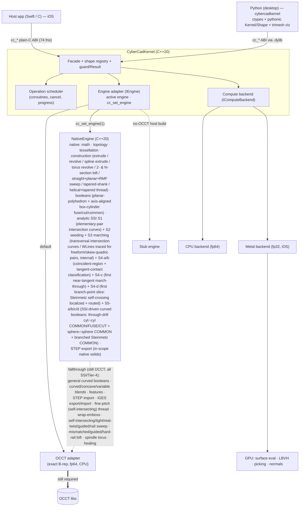

# CyberCadKernel

A portable, modern **C++20 geometry kernel** for precision CAD — built to power
[CyberCad](https://github.com/CyberdyneCorp) (iPadOS-first) and future
desktop/Android targets.

It lives behind a **stable plain-C ABI** (`cc_*`) and follows a
**wrap → accelerate → rewrite** strategy: it starts by wrapping
[OpenCASCADE (OCCT)](https://github.com/Open-Cascade-SAS/OCCT) as the exact B-rep
engine, then accelerates it (multi-core CPU + Metal GPU), adds features OCCT
lacks, and migrates capability-by-capability toward a **fully native C++20
kernel** that eventually drops OCCT (and its LGPL obligation) — all without ever
breaking the `cc_*` contract the app depends on.

> **License:** MIT. Wrapping OCCT (LGPL-2.1 + exception) carries the usual
> static-relink obligation until the native rewrite (Phase 4) removes it.

## Why

The public boundary is a plain-C facade — integer shape handles, POD structs, no
C++ or engine type crosses it. The host app never changes as the engine behind
the facade evolves:

- **CPU is the source of truth; the GPU is throughput.** Exact modeling is
  double-precision on the CPU. The GPU (Metal) handles only fp32-tolerant,
  data-parallel work (surface evaluation, BVH, picking, mesh post-processing).
- **Every capability is pluggable**, so an OCCT-backed and a native
  implementation can coexist and be compared behind the *same* facade call.
- **Determinism by default** — parallelism preserves reproducible results.

## Architecture



Both the iOS app and the desktop Python package are pure consumers of the same
`cc_*` ABI. Inside, the **engine adapter** routes each call to the **OCCT
adapter** (default) or the **NativeEngine** (opt-in via `cc_set_engine`); the
native engine handles what has been rewritten and **falls through to OCCT** for
the rest, so OCCT remains a required dependency until Phase 4 completes.

- **Facade** (`src/facade`) — every `cc_*` entry point is a guarded delegation to
  the active engine; owns the integer-handle shape registry and all buffer
  alloc/free. Engine exceptions collapse to `0/nil` + `cc_last_error`.
- **Core** (`src/core`) — in-house `Result<T,Error>`, exception guard, thread-safe
  shape registry, coroutine operation-scheduler (cancellable + progress), and the
  compute-backend interface with an fp64 precision guard.
- **Engine adapter** (`src/engine`) — `IEngine` grouped by capability
  (construct / boolean / feature / tessellate / query / transform / exchange),
  with an **OCCT adapter** (default), a no-op **stub** (no-OCCT host build), and a
  **`NativeEngine`** (`src/engine/native`, opt-in via `cc_set_engine`) that serves
  the rewritten capabilities and falls through to OCCT for the rest.
- **Native core** (`src/native`) — OCCT-free C++20: `math` (vectors/transforms +
  Bézier/B-spline/NURBS eval + Torus), `topology` (B-rep model + traversal), `tessellate`
  (watertight mesher), `construct` (extrude/revolve/spline extrude/torus revolve/
  2- &amp; N-section ruled loft/straight+planar+RMF sweep/tapered-shank/helical+tapered thread),
  `boolean` (planar-polyhedron fuse/cut/common
  via BSP-CSG + axis-aligned box-cylinder curved analytic fuse/cut/common, self-verified),
  `exchange` (native STEP AP203 EXPORT for in-scope native solids), `ssi` (internal
  surface-surface intersection — SSI-ROADMAP **S1** closed-form conics for elementary
  pairs vs OCCT `GeomAPI_IntSS`, plus **S2** subdivision seeding that finds a seed per
  TRANSVERSAL branch for the freeform / skew-quadric pairs S1 defers (recall 1.00 vs
  OCCT), plus **S3** marching-line tracer that walks each seed into a full transversal
  intersection curve (WLine) vs OCCT `IntPatch` — 5 pairs / 9 branches, all fully-traced,
  0 near-tangent-truncated, onSurf ≤ 6.81e-07; plus **S4-a/b** — coincident-region +
  tangent-contact CLASSIFICATION: typed `CoincidentRegion` (`FullSurfaceSame` /
  `OverlapSubRegion` / `Undecided`) and typed `TangentContact` (`TangentPoint` /
  `TangentCurve` / `NearTangentTransversal` / `Undecided`), verified vs OCCT
  `IntAna_QuadQuadGeo` / `IntPatch` (8 pairs, 0 deferred, emitted point/curve on both
  surfaces ≤ ~1e-16); plus **S4-c** — the FIRST near-tangent MARCH-THROUGH slice: the marcher
  now crosses a `NearTangentTransversal` single-branch graze that S3 truncated (a fixed-plane-cut
  corrector + curvature-aware predictor + fine step, behind an honesty-preserving crossable gate),
  verified vs OCCT `GeomAPI_IntSS` — a sphere grazed by an offset cylinder that S3 truncated now
  traces the FULL closed loop (`nearTangentGaps→0`, 22 nodes crossed, on the OCCT locus ≤ 5.6e-5),
  while genuine tangency STILL defers (no point fabricated past a degeneracy);
  plus **S4-d** — the FIRST BRANCH-POINT slice: where the intersection locus self-crosses, the
  marcher LOCALIZES the branch point, ENUMERATES the outgoing arms from the relative second
  fundamental form's tangent-cone quadratic (real distinct roots only), ROUTES each arm and
  ASSEMBLES the multi-arm curve — the **Steinmetz bicylinder** (two equal-R orthogonal cylinders)
  that S3+S4-c truncated is now FULLY traced vs OCCT `IntPatch`/`GeomAPI_IntSS` (2 branch points at
  `(0,±1,0)`, 4 arms → 2 crossing ellipses, `nearTangentGaps→0`, onCurve ≤ 1.74e-6 / onSurf ≤
  1.07e-8), while an isolated `TangentPoint` STILL ends with zero arms (no fabricated arms);
  plus **S5-a/b/c/d** — SSI-curve-driven
  curved booleans: the through-drill cyl∩cyl COMMON/FUSE/CUT, the sphere∩sphere COMMON lens, and
  the **branched-trace Steinmetz bicylinder COMMON** (equal-R orthogonal cyl∩cyl — split each
  cylinder along its arcs into the inside-the-other lune patches, weld the four into one
  watertight shell sharing the arc seams + the two branch-point vertices), verified watertight vs
  OCCT `BRepAlgoAPI_{Fuse,Cut,Common}` **and** the exact analytic `16 R³/3` (Steinmetz volN 5.3287,
  ΔV 8.75e-04 = −0.088%; all ΔV ≤ 9e-04, sim native-pass=6); Steinmetz FUSE/CUT still defer → OCCT;
  the deeper **S4-d general/freeform + S4-e…f marching core** (general/freeform branch points,
  cusps, singularities, self-intersection completeness, deeper near-coincident bands) is the
  pending moat, and Steinmetz fuse/cut + sphere fuse/cut + general non-Steinmetz branched pairs +
  wider curved-curved families consuming these WLines the pending S5 payoff), `numerics`
  (OCCT-free numeric facade — generic solvers + closest-point/projection over the
  **NumPP + SciPP** substrate, guarded by `CYBERCAD_HAS_NUMSCI`), and `mesh`
  (tetrahedral VOLUME meshing — `cc_tet_mesh` / `cc_tet_mesh_surface` emit CalculiX
  C3D4/C3D10 tets on the **OPTIONAL, EXTERNAL, AGPL-3.0 TetGen** backend, guarded by
  `CYBERCAD_HAS_TETGEN`, default OFF; plus always-on, TetGen-free native mesh-quality
  metrics via `cc_mesh_quality`). Host-buildable and unit-tested with no OCCT.
- **Numeric substrate** — **NumPP + SciPP**, the org's C++20, MIT
  NumPy/SciPy ports, are the kernel's OCCT-free numeric substrate (root/`fsolve`/BFGS/
  `least_squares`/`solve`/`lstsq` + `Extrema`-style closest-point). Referenced by absolute
  path exactly like OCCT (NOT vendored), CPU-only, `special`/`stats` excluded; built as
  `libnumsci_<target>.a` by `scripts/build-numsci.sh {host|iossim}` and linked behind
  `-DCYBERCAD_HAS_NUMSCI=ON` (default OFF, so the rest of `src/native` builds without them).
- **Compute backend** (`src/compute`) — default CPU backend + a **Metal** backend
  (iOS) for GPU work behind the same interface.

See [docs/ARCHITECTURE.md](docs/ARCHITECTURE.md) for detail.

### Where OCCT is still required

The native rewrite (Phase 4) is migrating capability-by-capability; OCCT stays
linked until it is complete. Current split:

| Native (C++20, verified vs OCCT) | Still OCCT-backed (native pending) |
|---|---|
| math / geometry primitives | **booleans**: GENERAL curved-face (surface-surface intersection: sphere / cone / NURBS / non-axis-aligned / cyl-cyl) |
| B-rep topology + traversal | booleans: general / concave-general / foreign operands |
| tessellation (watertight) | **blends**: curved-face fillet / chamfer / offset / shell (curved-surface blend + trimming) |
| **booleans: PLANAR-polyhedron fuse / cut / common** (axis-aligned boxes, prisms — BSP-CSG, self-verified EXACT vs OCCT) | blends: concave edges, variable-radius `cc_fillet_edges_variable`, `cc_fillet_face`, multi-edge interference |
| **booleans: AXIS-ALIGNED box ⟷ axis-parallel cylinder** cut (round through-hole) / fuse (boss) / common — closed-form `Cylinder`+`Circle`+`Plane` B-rep, analytic-volume self-verified vs OCCT | booleans: blind-hole / non-through cut / cyl−box, near-tangent / coincident-curved |
| **blends: `cc_chamfer_edges`** (convex planar-planar edge — EXACT vs OCCT) | blends: non-convex / oversized-thickness shell |
| **blends: `cc_offset_face`** (planar face along its normal — EXACT slab) | features (replace-face, etc.) |
| **blends: `cc_shell`** (uniform thickness, box-like planar solid — EXACT wall) | data exchange: **STEP IMPORT** + **IGES export/import** (parsing/writing arbitrary exchange formats) |
| **exchange: `cc_step_export`** (native ISO-10303-21 STEP AP203 for in-scope native solids — sewn manifold `MANIFOLD_SOLID_BREP`, OCCT re-read round-trip verified) | exchange: out-of-scope geometry kinds (Ellipse/Bezier curve, rational spline, Bezier surface) |
| **exchange: `cc_stl_export` / `cc_stl_import`** (native OCCT-free STL — binary/ASCII export with per-facet geometric normals + deterministic bytes; ASCII/binary auto-detect import as a welded mesh body, measurement + tessellation) | exchange: STL B-rep reconstruction (import is triangle-soup mesh only, by design) |
| **blends: `cc_fillet_edges`** (CONSTANT radius, convex planar-dihedral edge — rolling-ball cylinder, deflection-bounded) | booleans: near-tangent / coincident |
| construction: extrude, revolve (line-segment) | full general robust blend / offset over arbitrary NURBS solids |
| construction: holed extrude (circular + polygon holes) | sweep: tight-curvature / self-intersecting / real-twist / guided / rail (all SSI / Tier-4) |
| construction: typed-profile extrude (line / arc / full-circle) + kind-3 SPLINE profile edge | loft: mismatched-count / non-planar / guided / hard-rail (SSI / Tier-4) |
| construction: typed-profile revolve (line, on-axis arc → sphere) + off-axis-arc → TORUS | `cc_helical_thread` / `cc_tapered_thread` FINE-PITCH / self-intersecting (non-manifold → self-verify defers to OCCT `MakePipeShell`) |
| construction: 2-section AND N-section (3+) ruled loft (equal-count planar sections) | wrap-emboss: general curved-surface (planar-target reachable via native `cc_offset_face` #6 + native planar boolean #5; axis-aligned-cylinder-target boolean step now native via #5 curved slice) |
| construction: sweep (straight / smooth-planar / NON-PLANAR (RMF) spine) | general SPLINE surface-of-revolution; SPINDLE torus (off-axis arc crossing the axis — self-intersecting SoR) |
| **internal SSI (S1): analytic surface-surface intersection** — plane∩{plane/sphere/cyl/cone/torus}, sphere∩sphere, coaxial sphere∩cyl / sphere∩cone / cyl∩cone, coaxial+parallel cyl∩cyl (17 pairs, closed-form Line/Circle/Ellipse/Parabola/Hyperbola, verified vs OCCT `GeomAPI_IntSS`) | **SSI: marching THROUGH a degeneracy (S4-d…f)** — branch-point splitting, singularities, self-intersection *marching*, and deeper near-coincident bands still route to OCCT (SSI-ROADMAP S4-d…f — the moat tail; the S4-a/b coincident-region + tangent-contact *classification* and the S4-c first near-tangent *march-through* (crossable `NearTangentTransversal` graze) are now native, see the S4 rows below), **wider curved boolean *output* (S5)** — Steinmetz fuse/cut, sphere fuse/cut, general non-Steinmetz branched pairs, more curved-curved families, and non-Steinmetz near-tangent pairs consuming the S3 WLines are still OCCT (the through-drill cyl∩cyl COMMON/FUSE/CUT, the sphere∩sphere COMMON, and the branched Steinmetz COMMON are now native, see S5-a/b/c/d below) |
| **internal SSI (S3): marching-line tracer (transversal)** — walks each S2 seed into a full transversal intersection curve (WLine): predictor `t = n₁×n₂`, adaptive step, re-project onto both surfaces via the substrate, march both directions + stitch → `Closed`/`BoundaryExit`, dedup, fit a B-spline (guarded by `CYBERCAD_HAS_NUMSCI`). 5 pairs / 9 branches vs OCCT `IntPatch` — all fully-traced, 0 near-tangent-truncated, branch counts + 5/5 closed loops match OCCT, onSurf ≤ 6.81e-07, length within the step tol | **SSI: near-tangent-truncated marching** — a near-tangent branch below the S4-c crossable floor is traced only *up to* the tangent (`NearTangent`, counted in `nearTangentGaps`, never a point past it); a crossable `NearTangentTransversal` graze is now marched through (S4-c) and a transversal self-crossing branch point localized + routed (S4-d, both see rows below); general/freeform branch / singular / deeper-band cases route to S4-d(general)…f + OCCT, never faked |
| **internal SSI (S4-a/b): coincident-region + tangent-contact CLASSIFICATION** — typed `CoincidentRegion` (`FullSurfaceSame` closed-form for all elementary families + seeded `OverlapSubRegion` with delimited param bounds; `Undecided`→OCCT) and typed `TangentContact` (`TangentPoint`/`TangentCurve`/`NearTangentTransversal`/`Undecided`), analytic in closed form + seeded via the relative second fundamental form (guarded by `CYBERCAD_HAS_NUMSCI`). 8 pairs vs OCCT `IntAna_QuadQuadGeo`/`IntPatch` — 0 deferred, `Same`/`Point`/tangent `Line`/`Circle`/proper-section agree, emitted point/curve on both surfaces ≤ ~1e-16 | **SSI: S4-d…f marching core** — this classification layer only TYPES the degeneracy; a `NearTangentTransversal` is now handed to the S4-c marcher and a transversal self-crossing to the S4-d branch-point router (both see rows below), while general/freeform branch points, cusps, singularities and self-intersection completeness (S4-d general…f) route to OCCT (self-verify), never traced natively — the deeper marching core is the pending moat tail |
| **internal SSI (S4-c): near-tangent MARCH-THROUGH (first slice)** — the marcher now MARCHES THROUGH a `NearTangentTransversal` single-branch graze that S3 truncated: a fixed-plane-cut corrector (advance residual on the plane ⊥ the last-good forward tangent, well-posed as `n₁×n₂→0`) + curvature-aware predictor + fine deflection-bounded step, behind a crossable gate (steep-sine-collapse + band-minimum-floor witnesses that DEFER a branch/tangency; whole crossing arc discarded if any node fails on-both-surfaces verification). Guarded by `CYBERCAD_HAS_NUMSCI`. A sphere grazed by an offset cylinder that S3 truncated at `tangentSinTol=0.25` now traces the FULL closed loop vs OCCT `GeomAPI_IntSS` — `nearTangentGaps→0`, 22 nodes crossed, on the OCCT locus onCurve ≤ 5.6e-5 / onSurf ≤ 1.3e-5 | **SSI: singular / deeper-band march-through (S4-e…f)** — at the S4-c bar the equal-radius orthogonal-cylinder branch saddle defers (`nearTangentCrossed=0`) — that saddle is the S4-d branch-point case, now localized + routed (see S4-d row below); genuine `TangentPoint`/`TangentCurve` contacts, singularities, self-intersection, and any region below the crossable floor STILL stop + classify + defer to OCCT, never a fabricated crossing |
| **internal SSI (S4-d): branch points — self-crossing locus (first slice)** — where the intersection locus itself crosses (multiple arms meet at one point), the marcher LOCALIZES the branch point (`nn::minimize` the transversality sine `‖n_A×n_B‖` along the approach, re-projected onto both surfaces via the S4-c fixed-plane corrector + `nn::least_squares`), ENUMERATES the outgoing arms from the relative second fundamental form's tangent-cone quadratic (discriminant `Δ>0` ⇒ two real distinct tangent lines ⇒ up to four rays; `Δ≤0` ⇒ EMPTY — real distinct roots only, never fabricated), ROUTES each arm (step off B, S4-c-correct back on, S3-walk to termination) and ASSEMBLES the multi-arm curve with `BranchNode` connectivity + retrace dedup. Guarded by `CYBERCAD_HAS_NUMSCI`, default-on `enableBranchPoints`. The **Steinmetz bicylinder** (two equal-R=1 orthogonal cylinders) that S3+S4-c truncated at the saddle is now FULLY traced vs OCCT `IntPatch`/`GeomAPI_IntSS` — `branchPts=2` at `(0,±1,0)` (branch sine ≈ 5e-8), 4 `BranchArc` arms → the 2 crossing ellipses, `nearTangentGaps=0`, onCurve ≤ 1.74e-6 / onSurf ≤ 1.07e-8 | **SSI: general/freeform + cusp branch points, singularities (S4-d general…f)** — only the elementary two-real-distinct-line **transversal self-crossing** (Steinmetz family) is traced; general/freeform branch points, three-plus tangent lines, cusps (double root of the tangent-cone quadratic), S4-e singular points and S4-f self-intersection completeness DEFER → OCCT. An isolated `TangentPoint` (definite tangent cone, no real roots) STILL ENDS with zero arms — never fabricated |
| **internal SSI (S5-a/b/c/d): SSI-curve-driven curved booleans** — the split→classify→select→weld pipeline (`ssi_boolean.{h,cpp}`, consumes the S3 `TraceSet` — and, for S5-d, the S4-d branched re-trace; guarded by `CYBERCAD_HAS_NUMSCI`) produces the **through-drill cylinder∩cylinder COMMON/FUSE/CUT** (unequal radii, transversal two-loop trace), the **sphere∩sphere COMMON lens** (single closed seam; the two inside-the-other spherical caps welded along the one seam, direction-slerp facets robust at the parametric pole), and the **branched-trace Steinmetz bicylinder COMMON** (equal-R orthogonal cyl∩cyl — a `steinmetzPreGate` + branch-enabled re-trace + `recogniseSteinmetzTrace` for the canonical 2-branch-point / 4-`BranchArc` structure drive `buildSteinmetzCommon`, which splits each cylinder along its arcs into the inside-the-other lune patches and welds the four into ONE watertight shell sharing the arc seams + the two branch-point vertices): all watertight, ΔV ≤ 9e-04, ΔA ≤ 5e-04 vs OCCT `BRepAlgoAPI_{Fuse,Cut,Common}` — the Steinmetz COMMON additionally verified vs the EXACT analytic `16 R³/3 = 5.33333` (volN 5.3287, ΔV 8.75e-04 = −0.088%) (sim parity native-pass=6) | **SSI: wider S5 curved booleans** — **Steinmetz fuse/cut** (`ssi_boolean_solid` dispatches only `Op::Common` to the branched builder; fuse/cut return NULL → OCCT, valid+closed volO 32.366 / 13.516 — COMMON is the guaranteed slice), sphere fuse/cut (outer-cap union + re-trimmed remainder weld), any branched pair that is NOT equal-R orthogonal Steinmetz (unequal-R / non-orthogonal / ≠ 2-branch / ≠ 4-arm), other curved-curved families (cyl∩cone, cyl∩sphere, cone∩cone, sphere∩box, freeform), and near-tangent / coincident pairs decline to OCCT — honest NULL→OCCT fallbacks, never faked |
| **internal SSI (S2): subdivision seeding (transversal)** — ≥1 seed per TRANSVERSAL branch for the freeform (NURBS/Bézier/B-spline) and skew/non-closed-form quadric pairs S1 defers (skew cyl∩cyl, general cone∩cone, non-coaxial quadric pairs, oblique plane∩torus, sphere∩freeform): recursive patch-AABB subdivision + `least_squares` refine + branch dedup, verified at recall 1.00 vs OCCT `GeomAPI_IntSS`, seeds on both surfaces ≤ 3.51e-16 (guarded by `CYBERCAD_HAS_NUMSCI`) | **SSI: near-tangent / coincident seeding** — near-tangent (`n₁×n₂→0`), coincident / overlapping surfaces, degenerate (cusp / singular param) seeding are reported as `deferredTangent` and routed to S4 + OCCT, never faked |
| construction: `cc_tapered_shank` (silhouette revolved 360° about Z) | shape healing |
| **construction: `cc_helical_thread` / `cc_tapered_thread`** (well-formed radial-V helical tiling — per-turn seams weld watertight `boundaryEdges==0` at every deflection, verified vs OCCT `MakePipeShell`) | |

Native code is opt-in (`cc_set_engine(1)`); the **default engine remains OCCT**,
so shipped behaviour is unchanged. OCCT is unlinked only at the final `drop-occt`
step. See the sub-roadmap [openspec/NATIVE-REWRITE.md](openspec/NATIVE-REWRITE.md).

## Example

The ABI is plain C — no C++ or OCCT type crosses it. A body is an opaque integer
handle (`0` = invalid); geometry comes back as POD structs.

```c
#include <cybercadkernel/cc_kernel.h>

// A 10×10 profile, extruded 10mm into a box, then a corner rounded.
const double square[8] = {0,0, 10,0, 10,10, 0,10};

CCShapeId box     = cc_solid_extrude(square, 4, 10.0);   // -> a solid handle
CCShapeId tool    = cc_translate_shape(box, 5, 5, 5);
CCShapeId cut     = cc_boolean(box, tool, /*op=*/1);     // 0 fuse, 1 cut, 2 common

// Exact mass properties from the B-rep (not the mesh).
CCMassProps mp = cc_mass_properties(cut);
printf("volume = %.3f mm^3\n", mp.volume);

// Tessellate for display (deflection in mm). Optionally on the GPU (Metal).
cc_set_gpu_tessellation(1);                              // additive; default off
CCMesh mesh = cc_tessellate(cut, 0.1);
printf("%d triangles\n", mesh.triangleCount);

cc_mesh_free(mesh);
cc_shape_release(cut);
cc_shape_release(tool);
cc_shape_release(box);
```

Errors never cross the boundary as exceptions — a failed call returns `0`/`nil`
and records a message retrievable via `cc_last_error()`.

## Build & test

The library has two configurations. The **host** config (no OCCT, no Metal) is
CPU-only and fully unit-tested on macOS/Linux; the **iOS** config links OCCT (and,
optionally, Metal) and is verified on the iOS simulator.

```sh
# Host: CPU-only build + unit tests (stub engine + native core, no OCCT/Metal)
cmake -S . -B build \
  -DCMAKE_CXX_COMPILER=/opt/homebrew/opt/llvm/bin/clang++ \
  -DCYBERCAD_HAS_OCCT=OFF -DCYBERCAD_HAS_METAL=OFF
cmake --build build
cd build && ctest --output-on-failure          # -> 26/26 pass (incl. native math/topology/tessellate/construct/profile/residuals/loft/sweep/thread/boolean (planar + curved box-cylinder)/blend/step/engine/ssi/ssi-s4-classification)
```

```sh
# iOS simulator: OCCT-backed integrated suites (all 57 cc_* + accel + GPU + Phase 3)
bash scripts/run-sim-suite.sh          # 221/221 — full cc_* + determinism + benchmark
bash scripts/run-sim-gpu-suite.sh      #  26/26 — GPU-vs-CPU parity (Metal), ray + frustum pick
bash scripts/run-sim-integ-suite.sh    #  26/26 — GPU tessellation wired into cc_tessellate
bash scripts/run-sim-phase3-suite.sh   #  70/70 — native features (all planar full-round dihedrals)

# Phase 4 native-vs-OCCT parity (native core validated against the OCCT oracle)
bash scripts/run-sim-native-math.sh          # 24/24 — vec/transform + Bézier/B-spline/NURBS eval
bash scripts/run-sim-native-topology.sh      # 15/15 — counts, ancestry, accessors
bash scripts/run-sim-native-tessellation.sh  # 20/20 — watertight, area/volume vs OCCT
bash scripts/run-sim-native-construct.sh     # 17/17 — extrude/revolve vs OCCT through the facade
bash scripts/run-sim-native-construct-profiles.sh  # 22/22 — holed / typed-profile extrude + revolve
bash scripts/run-sim-native-loft.sh          # 17/17 — 2-section ruled loft vs OCCT ThruSections
bash scripts/run-sim-native-sweep.sh         # 11/11 — sweep (straight + smooth-planar) vs OCCT MakePipe
bash scripts/run-sim-native-thread.sh        # tapered-shank + helical/tapered thread (native, watertight) vs OCCT MakePipeShell/MakeRevol
bash scripts/run-sim-native-boolean.sh       # 25/25 — planar-polyhedron fuse/cut/common vs OCCT BOPAlgo
bash scripts/run-sim-curved-boolean.sh       # 18/18 — axis-aligned box-cylinder cut/fuse/common (native) + fallback vs OCCT BOPAlgo
bash scripts/run-sim-native-geomcompletion.sh # spline extrude / off-axis-arc torus revolve / N-section loft / non-planar (RMF) sweep (native) + SSI/Tier-4 fall-through vs OCCT
bash scripts/run-sim-native-numerics.sh      # 22/22 [NNUM] — native closest-point/projection vs OCCT Extrema (dDist ≤ 1.776e-15)
bash scripts/run-sim-native-ssi.sh           # 18/18 — SSI S1 analytic intersection curves vs OCCT GeomAPI_IntSS
bash scripts/run-sim-native-ssi-seeding.sh   #  3/3  — SSI S2 subdivision-seeding recall vs OCCT (recall 1.00)
bash scripts/run-sim-native-ssi-marching.sh  #  8/8  — SSI S3 marching tracer (5 transversal / 9 branches) + S4-c graze + S4-d eq-cyl defer/traced vs OCCT IntPatch
bash scripts/run-sim-native-ssi-s4.sh        #  8/8  — SSI S4-a/b coincident + tangent CLASSIFICATION vs OCCT IntAna_QuadQuadGeo/IntPatch (0 deferred)
bash scripts/run-sim-native-ssi-s4c.sh       #  7/7  — SSI S4-c near-tangent MARCH-THROUGH vs OCCT GeomAPI_IntSS (crossable graze traced, branch saddle deferred)
bash scripts/run-sim-native-ssi-s4d.sh       #  8/8  — SSI S4-d branch points vs OCCT IntPatch/GeomAPI_IntSS (Steinmetz fully traced: 2 branch pts, 4 arms; tangent point still ends)
bash scripts/run-sim-native-ssi-curved-boolean.sh # 18/18 — SSI S5-a/b/c/d curved booleans vs OCCT BRepAlgoAPI (native-pass=6: drill cyl∩cyl COMMON/FUSE/CUT + sphere∩sphere COMMON + branched Steinmetz COMMON; Steinmetz fuse/cut defer)
```

The native numeric facade (`src/native/numerics/`) is built over the **NumPP + SciPP**
substrate and gated by `CYBERCAD_HAS_NUMSCI` (default OFF). To build + test it on the host:

```sh
# Build the substrate archive, then configure the kernel with the numerics module ON
bash scripts/build-numsci.sh host              # -> libnumsci_host.a (77/77 TUs: 66 NumPP + 11 SciPP)
cmake -S . -B build-numsci \
  -DCMAKE_CXX_COMPILER=/opt/homebrew/opt/llvm/bin/clang++ \
  -DCYBERCAD_HAS_OCCT=OFF -DCYBERCAD_HAS_METAL=OFF -DCYBERCAD_HAS_NUMSCI=ON
cmake --build build-numsci
cd build-numsci && ctest --output-on-failure   # -> 31/31 pass (incl. test_native_numerics + test_native_ssi_seeding/marching + test_native_ssi_s4_classification)
```

#### Tetrahedral volume meshing (optional, external, AGPL TetGen)

Native tetrahedral VOLUME meshing (`cc_tet_mesh` / `cc_tet_mesh_surface`, emitting
CalculiX **C3D4/C3D10** tets) is backed by [**TetGen**](https://wias-berlin.de/software/tetgen/),
which is **AGPL-3.0**. To keep the shipped kernel MIT-clean the backend is
**OPTIONAL and OFF by default**, exactly like the NumSci substrate:

- **External, never vendored.** TetGen's sources (`tetgen.h`, `tetgen.cxx`,
  `predicates.cxx`) stay in their own tree (default `/home/leonardo/work/tetgen`)
  and are referenced by **absolute path** — no TetGen source is copied into or
  committed to this repo.
- **Flag-gated, default OFF.** The AGPL code compiles only under
  `-DCYBERCAD_HAS_TETGEN=ON`. The **default MIT build never compiles or links any
  AGPL code**; with the flag off, `cc_tet_mesh` / `cc_tet_mesh_surface` return an
  empty mesh and set `cc_last_error` to a "tet meshing unavailable" message — they
  never crash.
- **Quality is always on.** `cc_mesh_quality` (native, pure geometry — signed
  volume, dihedral angles, scaled Jacobian, aspect ratio) is TetGen-independent
  and compiles/tests in the default build.
- **Licensing.** Shipping a closed-source application that links TetGen requires a
  **TetGen commercial license**; the default MIT configuration avoids the
  obligation by not linking it.

```sh
# Build the external TetGen static archive, then configure the kernel with the mesher ON
bash scripts/build-tetgen.sh host              # -> build-tet/host/libtetgen_host.a (external sources, not vendored)
cmake -S . -B build-tet-mesh \
  -DCMAKE_CXX_COMPILER=/opt/homebrew/opt/llvm/bin/clang++ \
  -DCYBERCAD_HAS_OCCT=OFF -DCYBERCAD_HAS_METAL=OFF \
  -DCYBERCAD_HAS_TETGEN=ON \
  -DCYBERCAD_TETGEN_DIR="$PWD/build-tet/host" \
  -DCYBERCAD_TETGEN_SRC_DIR=/home/leonardo/work/tetgen
cmake --build build-tet-mesh
cd build-tet-mesh && ctest --output-on-failure   # adds test_native_tet (cube -> watertight C3D4/C3D10)
```

`test_native_quality` (mesh-quality metrics) runs in **every** configuration;
`test_native_tet` (the TetGen-backed volume mesher) is registered only when
`CYBERCAD_HAS_TETGEN=ON`. This delivery is **kernel-only** — wiring it into
CalculiX++'s `CadMesher` is a follow-up.

Full toolchain notes are in [docs/build.md](docs/build.md).

### Python (desktop)

A development-only Python package, `cybercadkernel`, drives the kernel through
the same `cc_*` ABI. It loads a **Homebrew-OCCT** desktop build
(`scripts/build-macos-dylib.sh` → `build-mac/libcybercadkernel.dylib`) so Python
exercises the *real* B-rep engine (`cc_brep_available() == 1`) — a low-level 1:1
`ctypes` binding, a pythonic `Kernel`/`Shape` object model (context-managed
handle lifetime, NumPy meshes, exceptions from `cc_last_error`), and `trimesh`
visualization. It is a pure consumer of the ABI and is **not shipped to iOS**.

```sh
brew install opencascade
scripts/build-macos-dylib.sh
pip install -e "python/[test]"
CYBERCADKERNEL_DYLIB="$PWD/build-mac/libcybercadkernel.dylib" \
  python -m pytest python/tests -q     # -> 35 passed, 1 skipped (real geometry)
```

See [docs/python.md](docs/python.md) for install, usage, viz helpers, and the
verified geometry numbers.

## Status

| Phase | What | Status |
|---|---|---|
| **0 — Foundation** | facade, registry, scheduler, compute-backend, OCCT adapter | ✅ complete at the simulator acceptance bar |
| **1 — Multi-core** | parallel OCCT booleans + meshing, determinism audit | ✅ complete at the simulator acceptance bar |
| **2 — GPU (Metal)** | Metal backend, GPU tessellation wired into `cc_tessellate`, BVH + ray/frustum pick | ✅ complete at the simulator acceptance bar |
| **3 — Missing features** | reference geometry, wrap-emboss, thread boolean, full-round (any planar dihedral) + G2 fillets | ✅ 5/5 (curved-neighbour full-round is the only residual) |
| **4 — Native rewrite** | replace OCCT capability-by-capability, then drop it | ◐ **substantially native (planar/analytic), progressing on the curved tail** — native math · topology · tessellation · construction (incl. spline/torus/N-loft/RMF-sweep/threads) · planar+box∩cyl booleans · planar blends · STEP export; **numeric foundations adopted (NumPP + SciPP)**; **SSI S1** (analytic intersection) + **S2** (subdivision seeding) + **S3** (marching-line tracer — full transversal intersection curves / WLines) + **S4-a/b** (coincident-region + tangent-contact classification) + **S4-c** (first near-tangent march-through — crossable `NearTangentTransversal` graze now traced) + **S4-d** (first branch-point slice — the **Steinmetz** self-crossing bicylinder localized + routed through both branch points; isolated tangent point still ends) + **S5-a/b/c/d** (SSI-driven curved booleans: through-drill cyl∩cyl COMMON/FUSE/CUT + sphere∩sphere COMMON + branched Steinmetz bicylinder COMMON, verified vs OCCT + the exact `16 R³/3`, native-pass=6) done vs OCCT. Pending: SSI **S4-d general/freeform + S4-e…f** marching core (general/freeform branch points, cusps, singularities, self-intersection completeness, deeper near-coincident bands — the moat tail) → wider S5 curved booleans (Steinmetz fuse/cut, sphere fuse/cut, general non-Steinmetz branched pairs, more families), general curved blends, STEP/IGES import, shape healing. drop-occt (#8) BLOCKED on these (research-grade, ≈9–18 py). See [openspec/SSI-ROADMAP.md](openspec/SSI-ROADMAP.md). |

The **acceptance bar** is the in-repo iOS-simulator suite (correctness verified
against analytic references, GPU vs CPU, and B-rep validity/watertightness).
Physical-device runs and the CyberCad app link-swap are optional, deferred
follow-ups. See [docs/STATUS.md](docs/STATUS.md) and
[openspec/ROADMAP.md](openspec/ROADMAP.md).

## Documentation

- **[docs/ROADMAP.md](docs/ROADMAP.md)** — phase plan and where things stand.
- **[docs/FEATURES.md](docs/FEATURES.md)** — capability catalogue (the `cc_*` surface).
- **[docs/STATUS.md](docs/STATUS.md)** — what is verified, and how to reproduce it.
- **[docs/ARCHITECTURE.md](docs/ARCHITECTURE.md)** — layers, seams, and design decisions.
- **[docs/python.md](docs/python.md)** — the desktop Python binding (`cybercadkernel`).
- **[docs/build.md](docs/build.md)** — toolchain and build instructions.
- **[openspec/NATIVE-REWRITE.md](openspec/NATIVE-REWRITE.md)** — Phase 4 native-rewrite sub-roadmap + drop-OCCT effort table.
- **[openspec/SSI-ROADMAP.md](openspec/SSI-ROADMAP.md)** — SSI → curved-booleans staged plan (S1–S5).
- **[openspec/](openspec/)** — spec-driven development: the canonical roadmap,
  per-capability specs, and change proposals.

## License

MIT — see [LICENSE](LICENSE).
