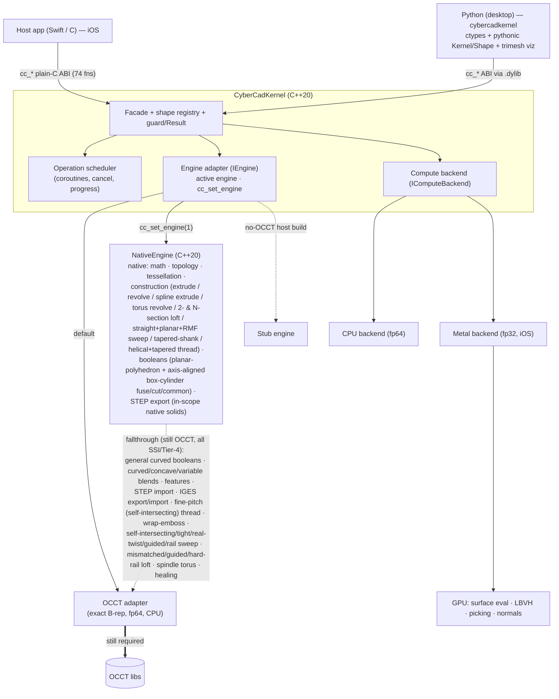

# CyberCadKernel

A portable, modern **C++20 geometry kernel** for precision CAD — built to power
[CyberCad](https://github.com/CyberdyneCorp) (iPadOS-first) and future
desktop/Android targets.

It lives behind a **stable plain-C ABI** (`cc_*`) and follows a
**wrap → accelerate → rewrite** strategy: it starts by wrapping
[OpenCASCADE (OCCT)](https://github.com/Open-Cascade-SAS/OCCT) as the exact B-rep
engine, then accelerates it (multi-core CPU + Metal GPU), adds features OCCT
lacks, and migrates capability-by-capability toward a **fully native C++20
kernel** that eventually drops OCCT (and its LGPL obligation) — all without ever
breaking the `cc_*` contract the app depends on.

> **License:** MIT. Wrapping OCCT (LGPL-2.1 + exception) carries the usual
> static-relink obligation until the native rewrite (Phase 4) removes it.

## Why

The public boundary is a plain-C facade — integer shape handles, POD structs, no
C++ or engine type crosses it. The host app never changes as the engine behind
the facade evolves:

- **CPU is the source of truth; the GPU is throughput.** Exact modeling is
  double-precision on the CPU. The GPU (Metal) handles only fp32-tolerant,
  data-parallel work (surface evaluation, BVH, picking, mesh post-processing).
- **Every capability is pluggable**, so an OCCT-backed and a native
  implementation can coexist and be compared behind the *same* facade call.
- **Determinism by default** — parallelism preserves reproducible results.

## Architecture



Both the iOS app and the desktop Python package are pure consumers of the same
`cc_*` ABI. Inside, the **engine adapter** routes each call to the **OCCT
adapter** (default) or the **NativeEngine** (opt-in via `cc_set_engine`); the
native engine handles what has been rewritten and **falls through to OCCT** for
the rest, so OCCT remains a required dependency until Phase 4 completes.

- **Facade** (`src/facade`) — every `cc_*` entry point is a guarded delegation to
  the active engine; owns the integer-handle shape registry and all buffer
  alloc/free. Engine exceptions collapse to `0/nil` + `cc_last_error`.
- **Core** (`src/core`) — in-house `Result<T,Error>`, exception guard, thread-safe
  shape registry, coroutine operation-scheduler (cancellable + progress), and the
  compute-backend interface with an fp64 precision guard.
- **Engine adapter** (`src/engine`) — `IEngine` grouped by capability
  (construct / boolean / feature / tessellate / query / transform / exchange),
  with an **OCCT adapter** (default), a no-op **stub** (no-OCCT host build), and a
  **`NativeEngine`** (`src/engine/native`, opt-in via `cc_set_engine`) that serves
  the rewritten capabilities and falls through to OCCT for the rest.
- **Native core** (`src/native`) — OCCT-free C++20: `math` (vectors/transforms +
  Bézier/B-spline/NURBS eval + Torus), `topology` (B-rep model + traversal), `tessellate`
  (watertight mesher), `construct` (extrude/revolve/spline extrude/torus revolve/
  2- &amp; N-section ruled loft/straight+planar+RMF sweep/tapered-shank/helical+tapered thread),
  `boolean` (planar-polyhedron fuse/cut/common
  via BSP-CSG + axis-aligned box-cylinder curved analytic fuse/cut/common, self-verified),
  `exchange` (native STEP AP203 EXPORT for in-scope native solids), and `numerics`
  (OCCT-free numeric facade — generic solvers + closest-point/projection over the
  **NumPP + SciPP** substrate, guarded by `CYBERCAD_HAS_NUMSCI`). Host-buildable and
  unit-tested with no OCCT.
- **Numeric substrate** — **NumPP + SciPP**, the org's C++20, MIT
  NumPy/SciPy ports, are the kernel's OCCT-free numeric substrate (root/`fsolve`/BFGS/
  `least_squares`/`solve`/`lstsq` + `Extrema`-style closest-point). Referenced by absolute
  path exactly like OCCT (NOT vendored), CPU-only, `special`/`stats` excluded; built as
  `libnumsci_<target>.a` by `scripts/build-numsci.sh {host|iossim}` and linked behind
  `-DCYBERCAD_HAS_NUMSCI=ON` (default OFF, so the rest of `src/native` builds without them).
- **Compute backend** (`src/compute`) — default CPU backend + a **Metal** backend
  (iOS) for GPU work behind the same interface.

See [docs/ARCHITECTURE.md](docs/ARCHITECTURE.md) for detail.

### Where OCCT is still required

The native rewrite (Phase 4) is migrating capability-by-capability; OCCT stays
linked until it is complete. Current split:

| Native (C++20, verified vs OCCT) | Still OCCT-backed (native pending) |
|---|---|
| math / geometry primitives | **booleans**: GENERAL curved-face (surface-surface intersection: sphere / cone / NURBS / non-axis-aligned / cyl-cyl) |
| B-rep topology + traversal | booleans: general / concave-general / foreign operands |
| tessellation (watertight) | **blends**: curved-face fillet / chamfer / offset / shell (curved-surface blend + trimming) |
| **booleans: PLANAR-polyhedron fuse / cut / common** (axis-aligned boxes, prisms — BSP-CSG, self-verified EXACT vs OCCT) | blends: concave edges, variable-radius `cc_fillet_edges_variable`, `cc_fillet_face`, multi-edge interference |
| **booleans: AXIS-ALIGNED box ⟷ axis-parallel cylinder** cut (round through-hole) / fuse (boss) / common — closed-form `Cylinder`+`Circle`+`Plane` B-rep, analytic-volume self-verified vs OCCT | booleans: blind-hole / non-through cut / cyl−box, near-tangent / coincident-curved |
| **blends: `cc_chamfer_edges`** (convex planar-planar edge — EXACT vs OCCT) | blends: non-convex / oversized-thickness shell |
| **blends: `cc_offset_face`** (planar face along its normal — EXACT slab) | features (replace-face, etc.) |
| **blends: `cc_shell`** (uniform thickness, box-like planar solid — EXACT wall) | data exchange: **STEP IMPORT** + **IGES export/import** (parsing/writing arbitrary exchange formats) |
| **exchange: `cc_step_export`** (native ISO-10303-21 STEP AP203 for in-scope native solids — sewn manifold `MANIFOLD_SOLID_BREP`, OCCT re-read round-trip verified) | exchange: out-of-scope geometry kinds (Ellipse/Bezier curve, rational spline, Bezier surface) |
| **blends: `cc_fillet_edges`** (CONSTANT radius, convex planar-dihedral edge — rolling-ball cylinder, deflection-bounded) | booleans: near-tangent / coincident |
| construction: extrude, revolve (line-segment) | full general robust blend / offset over arbitrary NURBS solids |
| construction: holed extrude (circular + polygon holes) | sweep: tight-curvature / self-intersecting / real-twist / guided / rail (all SSI / Tier-4) |
| construction: typed-profile extrude (line / arc / full-circle) + kind-3 SPLINE profile edge | loft: mismatched-count / non-planar / guided / hard-rail (SSI / Tier-4) |
| construction: typed-profile revolve (line, on-axis arc → sphere) + off-axis-arc → TORUS | `cc_helical_thread` / `cc_tapered_thread` FINE-PITCH / self-intersecting (non-manifold → self-verify defers to OCCT `MakePipeShell`) |
| construction: 2-section AND N-section (3+) ruled loft (equal-count planar sections) | wrap-emboss: general curved-surface (planar-target reachable via native `cc_offset_face` #6 + native planar boolean #5; axis-aligned-cylinder-target boolean step now native via #5 curved slice) |
| construction: sweep (straight / smooth-planar / NON-PLANAR (RMF) spine) | general SPLINE surface-of-revolution; SPINDLE torus (off-axis arc crossing the axis — self-intersecting SoR) |
| construction: `cc_tapered_shank` (silhouette revolved 360° about Z) | shape healing |
| **construction: `cc_helical_thread` / `cc_tapered_thread`** (well-formed radial-V helical tiling — per-turn seams weld watertight `boundaryEdges==0` at every deflection, verified vs OCCT `MakePipeShell`) | |

Native code is opt-in (`cc_set_engine(1)`); the **default engine remains OCCT**,
so shipped behaviour is unchanged. OCCT is unlinked only at the final `drop-occt`
step. See the sub-roadmap [openspec/NATIVE-REWRITE.md](openspec/NATIVE-REWRITE.md).

## Example

The ABI is plain C — no C++ or OCCT type crosses it. A body is an opaque integer
handle (`0` = invalid); geometry comes back as POD structs.

```c
#include <cybercadkernel/cc_kernel.h>

// A 10×10 profile, extruded 10mm into a box, then a corner rounded.
const double square[8] = {0,0, 10,0, 10,10, 0,10};

CCShapeId box     = cc_solid_extrude(square, 4, 10.0);   // -> a solid handle
CCShapeId tool    = cc_translate_shape(box, 5, 5, 5);
CCShapeId cut     = cc_boolean(box, tool, /*op=*/1);     // 0 fuse, 1 cut, 2 common

// Exact mass properties from the B-rep (not the mesh).
CCMassProps mp = cc_mass_properties(cut);
printf("volume = %.3f mm^3\n", mp.volume);

// Tessellate for display (deflection in mm). Optionally on the GPU (Metal).
cc_set_gpu_tessellation(1);                              // additive; default off
CCMesh mesh = cc_tessellate(cut, 0.1);
printf("%d triangles\n", mesh.triangleCount);

cc_mesh_free(mesh);
cc_shape_release(cut);
cc_shape_release(tool);
cc_shape_release(box);
```

Errors never cross the boundary as exceptions — a failed call returns `0`/`nil`
and records a message retrievable via `cc_last_error()`.

## Build & test

The library has two configurations. The **host** config (no OCCT, no Metal) is
CPU-only and fully unit-tested on macOS/Linux; the **iOS** config links OCCT (and,
optionally, Metal) and is verified on the iOS simulator.

```sh
# Host: CPU-only build + unit tests (stub engine + native core, no OCCT/Metal)
cmake -S . -B build \
  -DCMAKE_CXX_COMPILER=/opt/homebrew/opt/llvm/bin/clang++ \
  -DCYBERCAD_HAS_OCCT=OFF -DCYBERCAD_HAS_METAL=OFF
cmake --build build
cd build && ctest --output-on-failure          # -> 22/22 pass (incl. native math/topology/tessellate/construct/profile/residuals/loft/sweep/thread/boolean (planar + curved box-cylinder)/blend/step/engine)
```

```sh
# iOS simulator: OCCT-backed integrated suites (all 57 cc_* + accel + GPU + Phase 3)
bash scripts/run-sim-suite.sh          # 221/221 — full cc_* + determinism + benchmark
bash scripts/run-sim-gpu-suite.sh      #  26/26 — GPU-vs-CPU parity (Metal), ray + frustum pick
bash scripts/run-sim-integ-suite.sh    #  26/26 — GPU tessellation wired into cc_tessellate
bash scripts/run-sim-phase3-suite.sh   #  70/70 — native features (all planar full-round dihedrals)

# Phase 4 native-vs-OCCT parity (native core validated against the OCCT oracle)
bash scripts/run-sim-native-math.sh          # 24/24 — vec/transform + Bézier/B-spline/NURBS eval
bash scripts/run-sim-native-topology.sh      # 15/15 — counts, ancestry, accessors
bash scripts/run-sim-native-tessellation.sh  # 20/20 — watertight, area/volume vs OCCT
bash scripts/run-sim-native-construct.sh     # 17/17 — extrude/revolve vs OCCT through the facade
bash scripts/run-sim-native-construct-profiles.sh  # 22/22 — holed / typed-profile extrude + revolve
bash scripts/run-sim-native-loft.sh          # 17/17 — 2-section ruled loft vs OCCT ThruSections
bash scripts/run-sim-native-sweep.sh         # 11/11 — sweep (straight + smooth-planar) vs OCCT MakePipe
bash scripts/run-sim-native-thread.sh        # tapered-shank + helical/tapered thread (native, watertight) vs OCCT MakePipeShell/MakeRevol
bash scripts/run-sim-native-boolean.sh       # 25/25 — planar-polyhedron fuse/cut/common vs OCCT BOPAlgo
bash scripts/run-sim-curved-boolean.sh       # 18/18 — axis-aligned box-cylinder cut/fuse/common (native) + fallback vs OCCT BOPAlgo
bash scripts/run-sim-native-geomcompletion.sh # spline extrude / off-axis-arc torus revolve / N-section loft / non-planar (RMF) sweep (native) + SSI/Tier-4 fall-through vs OCCT
bash scripts/run-sim-native-numerics.sh      # 22/22 [NNUM] — native closest-point/projection vs OCCT Extrema (dDist ≤ 1.776e-15)
```

The native numeric facade (`src/native/numerics/`) is built over the **NumPP + SciPP**
substrate and gated by `CYBERCAD_HAS_NUMSCI` (default OFF). To build + test it on the host:

```sh
# Build the substrate archive, then configure the kernel with the numerics module ON
bash scripts/build-numsci.sh host              # -> libnumsci_host.a (77/77 TUs: 66 NumPP + 11 SciPP)
cmake -S . -B build-numsci \
  -DCMAKE_CXX_COMPILER=/opt/homebrew/opt/llvm/bin/clang++ \
  -DCYBERCAD_HAS_OCCT=OFF -DCYBERCAD_HAS_METAL=OFF -DCYBERCAD_HAS_NUMSCI=ON
cmake --build build-numsci
cd build-numsci && ctest --output-on-failure   # -> 23/23 pass (incl. test_native_numerics)
```

Full toolchain notes are in [docs/build.md](docs/build.md).

### Python (desktop)

A development-only Python package, `cybercadkernel`, drives the kernel through
the same `cc_*` ABI. It loads a **Homebrew-OCCT** desktop build
(`scripts/build-macos-dylib.sh` → `build-mac/libcybercadkernel.dylib`) so Python
exercises the *real* B-rep engine (`cc_brep_available() == 1`) — a low-level 1:1
`ctypes` binding, a pythonic `Kernel`/`Shape` object model (context-managed
handle lifetime, NumPy meshes, exceptions from `cc_last_error`), and `trimesh`
visualization. It is a pure consumer of the ABI and is **not shipped to iOS**.

```sh
brew install opencascade
scripts/build-macos-dylib.sh
pip install -e "python/[test]"
CYBERCADKERNEL_DYLIB="$PWD/build-mac/libcybercadkernel.dylib" \
  python -m pytest python/tests -q     # -> 35 passed, 1 skipped (real geometry)
```

See [docs/python.md](docs/python.md) for install, usage, viz helpers, and the
verified geometry numbers.

## Status

| Phase | What | Status |
|---|---|---|
| **0 — Foundation** | facade, registry, scheduler, compute-backend, OCCT adapter | ✅ complete at the simulator acceptance bar |
| **1 — Multi-core** | parallel OCCT booleans + meshing, determinism audit | ✅ complete at the simulator acceptance bar |
| **2 — GPU (Metal)** | Metal backend, GPU tessellation wired into `cc_tessellate`, BVH + ray/frustum pick | ✅ complete at the simulator acceptance bar |
| **3 — Missing features** | reference geometry, wrap-emboss, thread boolean, full-round (any planar dihedral) + G2 fillets | ✅ 5/5 (curved-neighbour full-round is the only residual) |
| **4 — Native rewrite** | replace OCCT capability-by-capability, then drop it | ◐ **complete at its achievable native ceiling** — native math · topology · tessellation · construction · STEP export (#7) done; booleans + blends planar/analytic slices done (general curved OCCT); STEP import + IGES stay OCCT; drop-occt (#8) BLOCKED on a general curved kernel + native import (research-grade) |

The **acceptance bar** is the in-repo iOS-simulator suite (correctness verified
against analytic references, GPU vs CPU, and B-rep validity/watertightness).
Physical-device runs and the CyberCad app link-swap are optional, deferred
follow-ups. See [docs/STATUS.md](docs/STATUS.md) and
[openspec/ROADMAP.md](openspec/ROADMAP.md).

## Documentation

- **[docs/ROADMAP.md](docs/ROADMAP.md)** — phase plan and where things stand.
- **[docs/FEATURES.md](docs/FEATURES.md)** — capability catalogue (the `cc_*` surface).
- **[docs/STATUS.md](docs/STATUS.md)** — what is verified, and how to reproduce it.
- **[docs/ARCHITECTURE.md](docs/ARCHITECTURE.md)** — layers, seams, and design decisions.
- **[docs/python.md](docs/python.md)** — the desktop Python binding (`cybercadkernel`).
- **[docs/build.md](docs/build.md)** — toolchain and build instructions.
- **[openspec/NATIVE-REWRITE.md](openspec/NATIVE-REWRITE.md)** — Phase 4 native-rewrite sub-roadmap.
- **[openspec/](openspec/)** — spec-driven development: the canonical roadmap,
  per-capability specs, and change proposals.

## License

MIT — see [LICENSE](LICENSE).
