# CyberCadKernel

A portable, modern **C++20 geometry kernel** for precision CAD — built to power
[CyberCad](https://github.com/CyberdyneCorp) (iPadOS-first) and future
desktop/Android targets.

It lives behind a **stable plain-C ABI** (`cc_*`) and follows a
**wrap → accelerate → rewrite** strategy: it starts by wrapping
[OpenCASCADE (OCCT)](https://github.com/Open-Cascade-SAS/OCCT) as the exact B-rep
engine, then accelerates it (multi-core CPU + Metal GPU), adds features OCCT
lacks, and migrates capability-by-capability toward a **fully native C++20
kernel** that eventually drops OCCT (and its LGPL obligation) — all without ever
breaking the `cc_*` contract the app depends on.

> **License:** MIT. Wrapping OCCT (LGPL-2.1 + exception) carries the usual
> static-relink obligation until the native rewrite (Phase 4) removes it.

## Why

The public boundary is a plain-C facade — integer shape handles, POD structs, no
C++ or engine type crosses it. The host app never changes as the engine behind
the facade evolves:

- **CPU is the source of truth; the GPU is throughput.** Exact modeling is
  double-precision on the CPU. The GPU (Metal) handles only fp32-tolerant,
  data-parallel work (surface evaluation, BVH, picking, mesh post-processing).
- **Every capability is pluggable**, so an OCCT-backed and a native
  implementation can coexist and be compared behind the *same* facade call.
- **Determinism by default** — parallelism preserves reproducible results.

## Performance & footprint (measured)

The native engine is not just an OCCT replacement — it is **materially faster on the
hot interactive path and tens-to-hundreds of MB lighter to ship**. Measured native
vs OCCT on the *same* `cc_*` operations, on identical self-verified-correct results
(host macOS arm64, Homebrew OCCT 7.9.3, median-of-25 after warm-up; deterministic
N-gon inputs). Full method, per-size rows, and honest caveats:
[docs/BENCH-native-vs-occt.md](docs/BENCH-native-vs-occt.md).

**Latency — native speedup** (ratio = OCCT / native; >1 ⇒ native faster):

| op | small | medium | large |
|---|--:|--:|--:|
| boolean (fuse / cut / common) | 14–20× | 10–15× | 8–10× |
| tessellate | 14.9× | 13.3× | 10.6× |
| mass_properties | 8.5× | 7.9× | 7.2× |

`section` is **native-only** (the OCCT adapter declines it, so no like-for-like ratio);
`fillet_edges` **forwards** to OCCT today (curved fillet face) — no native win, an
honest decline that becomes a clean decline after unlink.

**Binary footprint** (iOS-simulator arm64 shipping slice, OCCT-linked vs native-only):

| | MB |
|---|--:|
| OCCT static dependency dropped (linked-toolkit subset) | **112.15** (140.78 full trimmed install) |
| Dead-stripped **in-binary** reduction (representative reachable set) | **28.05** |
| Native-only kernel `.a` | 2.66 (vs 3.74 with the OCCT adapter) |

Dropping OCCT removes 16 adapter TUs / 259 symbols and **hundreds of MB of static
libraries you no longer build, vendor, ship, or code-sign** — the iPad shipping win —
in exchange for a ~1 MB kernel-side native adapter. **Net: 7–20× faster on the ops
the app runs most, and far lighter to ship** — the two-sided justification for
[`drop-occt`](openspec/MOAT-ROADMAP.md).

## Architecture

```mermaid
flowchart TD
    App["Host app (Swift / C) — iOS"] -->|"cc_* plain-C ABI (74 fns)"| Facade
    Py["Python (desktop) — cybercadkernel<br/>ctypes + pythonic Kernel/Shape + trimesh viz"] -->|"cc_* ABI via .dylib"| Facade

    subgraph Kernel["CyberCadKernel (C++20)"]
        Facade["Facade + shape registry + guard/Result"]
        Sched["Operation scheduler<br/>(coroutines, cancel, progress)"]
        Engine["Engine adapter (IEngine)<br/>active engine · cc_set_engine"]
        Compute["Compute backend (IComputeBackend)"]

        Facade --> Sched
        Facade --> Engine
        Facade --> Compute
    end

    Engine -->|"default"| OCCT["OCCT adapter<br/>(exact B-rep, fp64, CPU)"]
    Engine -->|"cc_set_engine(1)"| Native["NativeEngine (C++20)<br/>native: math · topology · tessellation ·<br/>construction (extrude / revolve / spline extrude / torus revolve / 2- &amp; N-section loft (equal- OR mismatched-count via arc-length correspondence) / straight+planar+RMF sweep / tapered-shank / helical+tapered thread) ·<br/>booleans (planar-polyhedron + axis-aligned box-cylinder fuse/cut/common) ·<br/>blends (planar-dihedral fillet/chamfer/offset/shell + constant-radius CURVED fillet on a circular cylinder↔cap rim, CONVEX + CONCAVE (boss/shoulder base rim, material-adding) — rolling-ball TORUS canal, G1-tangent + VARIABLE-radius (linear law) CONVEX circular cyl↔cap fillet — swept-radius canal, G1-tangent at both varying-radius seams + CURVED CONVEX circular cyl↔cap CHAMFER — CONE-FRUSTUM straight bevel, C0 at the chamfer angle NOT G1, SYMMETRIC via `cc_chamfer_edges` AND ASYMMETRIC two-distance `d1≠d2` via `cc_chamfer_edges_asym` (OBLIQUE cone frustum, C0 at two different angles), tight vs OCCT `BRepFilletAPI_MakeChamfer`) ·<br/>features (wrap-emboss: rectangular pad on a cylinder lateral face, wrapped side walls + outer cap) ·<br/>analytic SSI S1 (elementary-pair intersection curves) + S2 seeding + S3 marching (transversal intersection curves / WLines traced for freeform/skew-quadric pairs, internal) + S4-a/b (coincident-region + tangent-contact classification) + S4-c (first near-tangent march-through) + S4-d (first branch-point slice: Steinmetz self-crossing localized + routed) + S4-e (chart singularities: analytic sphere parametric pole + cone apex + FREEFORM NURBS collapsed-row pole crossed via `freeformChartInvert`; curve cusp declined by IFT) + S4-f (robust true-return loop-closure + self-intersection guard + adaptive completeness-critic re-seed — measured recall floor, not a proof) + S5-a/b/c/d/e/f (SSI-driven curved booleans: through-drill cyl∩cyl COMMON/FUSE/CUT + sphere∩sphere COMMON/FUSE/CUT (3/3) + branched Steinmetz COMMON/FUSE/CUT (3/3) + coaxial cone∩cylinder COMMON/FUSE/CUT (3/3, CONE family) + coaxial cone∩sphere COMMON/FUSE/CUT (3/3, CONE∩SPHERE family)) ·<br/>STEP export (in-scope native solids) ·<br/>STEP import (native slice, WIDENED: OCCT-free Part-21 reader for the elementary/B-spline subset + foreign OCCT-written box/cylinder + multi-solid Compound + B-spline-FACE round-trip + ELLIPSE-curve recognition + TRIMMED_CURVE edges + SURFACE_OF_REVOLUTION→cylinder/cone/plane + a FULL SPHERE (SPHERICAL_SURFACE and on-axis-circle SURFACE_OF_REVOLUTION → native watertight Sphere via the VERTEX_LOOP periodic-pole face) + a FULL TORUS (TOROIDAL_SURFACE / off-axis-circle SURFACE_OF_REVOLUTION → native watertight Kind::Torus) + an ELLIPSE / non-rational-B-spline generatrix SURFACE_OF_REVOLUTION → native watertight rational tensor B-spline surface (Kind::BSpline with weights, no tessellator change) + RIGID/UNIFORM-SCALE/MIRROR PLACED ASSEMBLIES + AP203/AP214/AP242 geometry with PMI skipped, healed + self-verified watertight else → OCCT) ·<br/>shape healing FIRST SLICE (internal: tolerant sew + vertex/tolerance unification + degenerate removal + orientation fix of a coincident-within-tolerance face soup → watertight solid)"]
    Engine -.->|"no-OCCT host build"| Stub["Stub engine"]

    Native -.->|"fallthrough (still OCCT, all SSI/Tier-4):<br/>general curved booleans · non-linear-law/concave-variable/non-circular-crease (elliptical, T2)/cyl↔cyl-canal (T3) fillets (constant convex+concave AND variable-radius linear-law convex circular rims now native) + non-circular/concave/cyl↔cyl curved chamfer (convex-circular cyl↔cap cone-frustum chamfer — SYMMETRIC + ASYMMETRIC two-distance — now native) · deboss + non-rectangular/non-cylindrical/&gt;2π wrap-emboss ·<br/>STEP import beyond the widened subset (PMI semantics · non-uniform/shear transforms · deep-nested assemblies · a PARTIAL/trimmed torus · an off-axis-ellipse / skew-line-hyperboloid revolution (the ellipse / non-rational-B-spline generatrix revolution is now native) · ellipse-on-quadric solids · complex/trimmed profiles · arbitrary directly-authored rational B-spline surfaces) · IGES export/import · fine-pitch (self-intersecting) thread ·<br/>self-intersecting/tight/real-twist/guided/rail sweep · non-planar/punctual-section/guided/hard-rail loft (mismatched-count loft is now native; a resampled cap that fails the watertight self-verify still delegates) · spindle torus · healing RESIDUAL (beyond-tol gaps · missing pcurves · self-intersecting wires · arbitrary broken B-rep)"| OCCT
    OCCT ==>|"still required"| OCCTlib[("OCCT libs")]

    Compute --> CPUb["CPU backend (fp64)"]
    Compute --> Metal["Metal backend (fp32, iOS)"]
    Metal --> GPU["GPU: surface eval · LBVH · picking · normals"]
```



Both the iOS app and the desktop Python package are pure consumers of the same
`cc_*` ABI. Inside, the **engine adapter** routes each call to the **OCCT
adapter** (default) or the **NativeEngine** (opt-in via `cc_set_engine`); the
native engine handles what has been rewritten and **falls through to OCCT** for
the rest, so OCCT remains a required dependency until Phase 4 completes.

- **Facade** (`src/facade`) — every `cc_*` entry point is a guarded delegation to
  the active engine; owns the integer-handle shape registry and all buffer
  alloc/free. Engine exceptions collapse to `0/nil` + `cc_last_error`.
- **Core** (`src/core`) — in-house `Result<T,Error>`, exception guard, thread-safe
  shape registry, coroutine operation-scheduler (cancellable + progress), and the
  compute-backend interface with an fp64 precision guard.
- **Engine adapter** (`src/engine`) — `IEngine` grouped by capability
  (construct / boolean / feature / tessellate / query / transform / exchange),
  with an **OCCT adapter** (default), a no-op **stub** (no-OCCT host build), and a
  **`NativeEngine`** (`src/engine/native`, opt-in via `cc_set_engine`) that serves
  the rewritten capabilities and falls through to OCCT for the rest.
- **Native core** (`src/native`) — OCCT-free C++20: `math` (vectors/transforms +
  Bézier/B-spline/NURBS eval + Torus), `topology` (B-rep model + traversal), `tessellate`
  (watertight mesher), `construct` (extrude/revolve/spline extrude/torus revolve/
  2- &amp; N-section ruled loft (incl. mismatched-count)/straight+planar+RMF sweep/tapered-shank/helical+tapered thread),
  `boolean` (planar-polyhedron fuse/cut/common
  via BSP-CSG + axis-aligned box-cylinder curved analytic fuse/cut/common, self-verified),
  `exchange` (native STEP AP203 EXPORT + IMPORT widened slice for in-scope native solids + foreign OCCT-written box/cylinder + multi-solid compounds + B-spline-face round-trip + ELLIPSE-curve recognition + rigid/uniform-scale/mirror placed assemblies + AP203/AP214/AP242 geometry with PMI skipped), `ssi` (internal
  surface-surface intersection — SSI-ROADMAP **S1** closed-form conics for elementary
  pairs vs OCCT `GeomAPI_IntSS`, plus **S2** subdivision seeding that finds a seed per
  TRANSVERSAL branch for the freeform / skew-quadric pairs S1 defers (recall 1.00 vs
  OCCT), plus **S3** marching-line tracer that walks each seed into a full transversal
  intersection curve (WLine) vs OCCT `IntPatch` — 5 pairs / 9 branches, all fully-traced,
  0 near-tangent-truncated, onSurf ≤ 6.81e-07; plus **S4-a/b** — coincident-region +
  tangent-contact CLASSIFICATION: typed `CoincidentRegion` (`FullSurfaceSame` /
  `OverlapSubRegion` / `Undecided`) and typed `TangentContact` (`TangentPoint` /
  `TangentCurve` / `NearTangentTransversal` / `Undecided`), verified vs OCCT
  `IntAna_QuadQuadGeo` / `IntPatch` (8 pairs, 0 deferred, emitted point/curve on both
  surfaces ≤ ~1e-16); plus **S4-c** — the FIRST near-tangent MARCH-THROUGH slice: the marcher
  now crosses a `NearTangentTransversal` single-branch graze that S3 truncated (a fixed-plane-cut
  corrector + curvature-aware predictor + fine step, behind an honesty-preserving crossable gate),
  verified vs OCCT `GeomAPI_IntSS` — a sphere grazed by an offset cylinder that S3 truncated now
  traces the FULL closed loop (`nearTangentGaps→0`, 22 nodes crossed, on the OCCT locus ≤ 5.6e-5),
  while genuine tangency STILL defers (no point fabricated past a degeneracy);
  plus **S4-d** — the FIRST BRANCH-POINT slice: where the intersection locus self-crosses, the
  marcher LOCALIZES the branch point, ENUMERATES the outgoing arms from the relative second
  fundamental form's tangent-cone quadratic (real distinct roots only), ROUTES each arm and
  ASSEMBLES the multi-arm curve — the **Steinmetz bicylinder** (two equal-R orthogonal cylinders)
  that S3+S4-c truncated is now FULLY traced vs OCCT `IntPatch`/`GeomAPI_IntSS` (2 branch points at
  `(0,±1,0)`, 4 arms → 2 crossing ellipses, `nearTangentGaps→0`, onCurve ≤ 1.74e-6 / onSurf ≤
  1.07e-8), while an isolated `TangentPoint` STILL ends with zero arms (no fabricated arms);
  plus **S4-e** — the CHART-SINGULARITY slices (analytic sphere pole + cone apex, and the FREEFORM NURBS pole): where ONE surface's own `(u,v)` parametrization
  degenerates (`‖dU‖→0`) while its point + normal stay finite — a **sphere parametric pole**
  (`v=±π/2`) or a **cone apex** — the intersection can be perfectly transversal yet S3's
  single-surface predictor goes rank-1 and truncates. The marcher now DETECTS the collapse from a
  single-surface `‖dU‖/‖dV‖` witness (distinct from the S4-c pair sine and S4-d locus flip), STEPS
  ACROSS with a point-based fixed-plane cut along the last-good tangent `t★` (never touching the
  degenerate `dU`), and maps the far side back by chart continuity (sphere pole → opposite meridian
  `u+π`; cone apex → far nappe `v→−v`) — a great circle crossing BOTH sphere poles that S3
  truncated at half loop (`len≈3.1415`) is now FULLY traced vs OCCT `GeomAPI_IntSS` (`singX=2`,
  `nearTangentGaps→0`, closed, `len` 6.2829 vs 6.2832, on locus + both surfaces ≤ 1.51e-07), and a
  double-cone∩plane line through the apex FULLY traced across both nappes (`singX=1`, 159 nodes,
  on-surface ≤ 6.79e-16). A **second slice** extends this to the FREEFORM analog — a NURBS unit
  sphere (a `uPeriod==0` collapsed-control-row pole, no analytic `u+π` map) ∩ plane now FULLY
  traced by re-seeding the far side with `freeformChartInvert` (a point-only far-longitude
  inversion; the corrector never touches the degenerate `dU` or near-zero normal) — `singX=2`,
  closed, `len` 6.2829 vs 6.2832, on both surfaces ≤ 1.51e-07. A genuine finite cylinder `v`-cap
  still exits cleanly, a collapsed-row endpoint on a domain boundary (a Bézier cone-tip, no far
  side) STILL defers → OCCT, and the **curve cusp** was DECLINED (by the IFT it coincides with the
  S4-c/S4-d pair-tangency regime — a standalone cusp witness would be dead code — so cusps route
  to S4-c/S4-d/OCCT, never faked); no crossing is ever fabricated;
  plus **S4-f** — the COMPLETENESS + LOOP-ROBUSTNESS slice (hardens curves already traced,
  adds no new capability): loop-closure is now a **TRUE-RETURN** test (return to the seed AND
  tangent-continuous — heading the way it left, `arcLen` past the closure window) so a curve
  merely passing near its seed / an earlier node no longer FALSE-CLOSES (fixture B closes at
  **99.6%** of true length at the default window and refuses the premature stop at 10×/20×
  inflation — it can only REFUSE a close, never manufacture one, so every transversal control
  is byte-identical); a **self-intersection guard** (segment-segment closest-approach at a
  transverse angle, default OFF) DETECTS + TRACES THROUGH a single-arm figure-eight
  self-crossing as typed data — the **Gerono eight** records one transverse crossing near the
  origin, `branchPts=0` (distinct from an S4-d locus branch), the arm not stopped, vs OCCT's
  single self-crossing locus; and an **adaptive completeness-critic** re-seed (default OFF /
  boolean-path) re-subdivides FINER in param regions no traced curve covers, loop-until-dry,
  bounded by a cost cap — recovering small loops the fixed 1/32 subdivision silently misses
  (fixture A recall **0.50→1.00** at floor **1/128**; adversarial many-loops D **0.25→1.00**
  at floor **1/48**, both vs OCCT `GeomAPI_IntSS` branch counts, every recovered node on both
  surfaces ≤ 1e-11 — never a fabricated loop or seed). **Completeness is MEASURED per-fixture
  at the reached floor, NOT a proof: below ANY fixed subdivision resolution a smaller loop can
  still be missed** (`completenessResidual` stays true) — S4-f RAISES the recall floor and
  **de-risks (does NOT unblock/complete) curved blends #6 + wrap-emboss #7**, whose seams are
  exactly these small-loop / self-intersecting / many-loop patterns (watertight
  self-intersection arc-splitting + global topology repair remain the S5/S6/S7 tail);
  plus **S5-a/b/c/d/e/f** — SSI-curve-driven
  curved booleans: the through-drill cyl∩cyl COMMON/FUSE/CUT, the sphere∩sphere op-set now
  COMPLETE 3/3 native — COMMON + FUSE + CUT (COMMON = two INNER caps; FUSE = two OUTER caps,
  `V=V(A)+V(B)−lens`; CUT = OUTER cap of A + reversed INNER cap of B, `V=V(A)−lens`; one shared
  seam, one generalised `appendSphereCap(outer,reversed)` builder), and
  the **branched-trace Steinmetz bicylinder COMMON** (equal-R orthogonal cyl∩cyl — split each
  cylinder along its arcs into the inside-the-other lune patches, weld the four into one
  watertight shell sharing the arc seams + the two branch-point vertices), verified watertight vs
  OCCT `BRepAlgoAPI_{Fuse,Cut,Common}` **and** the analytic closed forms (Steinmetz volN 5.3287,
  ΔV 8.75e-04 = −0.088%; sphere FUSE ΔV ≤ 8.3e-04 / CUT ΔV ≤ 9.3e-04; all ΔV ≤ 9e-04), and the
  **CONE surface family — coaxial cone(frustum)∩cylinder op-set now COMPLETE 3/3 native
  (COMMON/FUSE/CUT)** (a shared `coneCylSetup` prologue: a SINGLE S1-analytic seam circle where
  `r_c(s)=R0+s·tanα` equals `Rc`, apex-free, one pooled ring; `buildConeCylCommon` welds the
  min-radius-profile solid, `buildConeCylFuse` (A∪B) keeps both OUTER walls + caps + annular step
  caps (`V=V(A)+V(B)−V(A∩B)`), `buildConeCylCut` (A−B, order-sensitive) keeps A's outer wall + caps
  + the cylinder's inside-A band REVERSED — a disconnected tip + washer solid (`V=V(A)−V(A∩B)`)),
  each verified vs a DUAL oracle — the analytic inclusion-exclusion closed form AND OCCT
  `BRepAlgoAPI_{Common,Fuse,Cut}` (COMMON volN 19.107 / OCCT 19.111 ΔV 2.03e-04; FUSE volN 41.618 /
  analytic 41.62610 / OCCT 41.626 ΔV 2.04e-04; CUT volN 13.349 / analytic 13.35177 / OCCT 13.352
  ΔV 2.03e-04), and the **CONE∩SPHERE family — coaxial cone(frustum)∩sphere op-set now COMPLETE
  3/3 native (COMMON/FUSE/CUT)** (a shared `coneSphereSetup` prologue: the sphere centre ON the cone
  axis on the frustum side → a SINGLE S1-analytic circle seam at the one interior crossing `s*`, one
  pooled ring; the cone side reuses the cone-wall split, the sphere side the `appendSphereCap`
  builder; `buildConeSphereCommon` welds the cone band inside the sphere + the sphere INNER cap
  (`V=V_frustum+V_spherical-segment`), `buildConeSphereFuse` (A∪B) keeps the sphere OUTER cap + the
  cone OUTER wall (`V=V(A)+V(B)−V(A∩B)`), `buildConeSphereCut` (A−B, cone minuend) keeps A's outer
  wall + the sphere INNER cap REVERSED — a CONNECTED frustum-with-spherical-dimple (`V=V(A)−V(A∩B)`)),
  each verified vs a DUAL oracle (analytic inclusion-exclusion AND OCCT: COMMON volN 5.2546 / OCCT
  5.2558 ΔV 2.41e-04; FUSE volN 60.686 / OCCT 60.718 ΔV 5.22e-04; CUT volN 27.202 / OCCT 27.207 ΔV
  1.96e-04); sim native-pass=18; transversal/apex cone pairs + cone∩cone + the two-circle /
  apex-crossing / transversal cone∩sphere crossings + the `sphere−cone` sphere-minuend CUT still
  defer → OCCT;
  the deeper **S4-d general/freeform + S4-e general/freeform + S4-f general small-loop residual**
  (general/freeform branch points, higher-order/curve cusps, general/freeform parametric
  singularities, small loops below the critic's reached floor, self-intersection arc-splitting +
  topology repair, deeper near-coincident bands) is the
  pending moat, and general non-Steinmetz branched pairs +
  wider curved-curved families consuming these WLines the pending S5 payoff — the sphere∩sphere
  op-set is now COMPLETE 3/3 native), `numerics`
  (OCCT-free numeric facade — generic solvers + closest-point/projection over the
  **NumPP + SciPP** substrate, guarded by `CYBERCAD_HAS_NUMSCI`), and `mesh`
  (tetrahedral VOLUME meshing — `cc_tet_mesh` / `cc_tet_mesh_surface` emit CalculiX
  C3D4/C3D10 tets on the **OPTIONAL, EXTERNAL, AGPL-3.0 TetGen** backend, guarded by
  `CYBERCAD_HAS_TETGEN`, default OFF; plus always-on, TetGen-free native mesh-quality
  metrics via `cc_mesh_quality`), and `heal` (INTERNAL shape-healing FIRST SLICE —
  `healShell` stitches a coincident-within-tolerance face soup / malformed shell into a
  watertight consistently-oriented solid via tolerant sewing + vertex/tolerance unification +
  degenerate removal + orientation fix, self-verified watertight + `V>0`, or reports UNHEALED
  honestly; verified vs OCCT `BRepBuilderAPI_Sewing`/`ShapeFix`; the gating foundation for a
  future native STEP import). Host-buildable and unit-tested with no OCCT.
- **Numeric substrate** — **NumPP + SciPP**, the org's C++20, MIT
  NumPy/SciPy ports, are the kernel's OCCT-free numeric substrate (root/`fsolve`/BFGS/
  `least_squares`/`solve`/`lstsq` + `Extrema`-style closest-point). Referenced by absolute
  path exactly like OCCT (NOT vendored), CPU-only, `special`/`stats` excluded; built as
  `libnumsci_<target>.a` by `scripts/build-numsci.sh {host|iossim}` and linked behind
  `-DCYBERCAD_HAS_NUMSCI=ON` (default OFF, so the rest of `src/native` builds without them).
- **Compute backend** (`src/compute`) — default CPU backend + a **Metal** backend
  (iOS) for GPU work behind the same interface.

See [docs/ARCHITECTURE.md](docs/ARCHITECTURE.md) for detail.

### Where OCCT is still required

The native rewrite (Phase 4) is migrating capability-by-capability; OCCT stays
linked until it is complete. Current split:

| Native (C++20, verified vs OCCT) | Still OCCT-backed (native pending) |
|---|---|
| math / geometry primitives | **booleans**: GENERAL curved-face (surface-surface intersection: sphere / cone / NURBS / non-axis-aligned / cyl-cyl) |
| B-rep topology + traversal | booleans: general / concave-general / foreign operands |
| tessellation (watertight) | **blends**: curved-face fillet / chamfer / offset / shell (curved-surface blend + trimming) |
| **booleans: PLANAR-polyhedron fuse / cut / common** (axis-aligned boxes, prisms — BSP-CSG, self-verified EXACT vs OCCT) | blends: `cc_fillet_edges_variable` beyond the convex circular linear-law slice (non-linear law / concave-variable / cyl↔cyl canal / non-circular crease), `cc_fillet_face`, multi-edge interference |
| **booleans: AXIS-ALIGNED box ⟷ axis-parallel cylinder** cut (round through-hole) / fuse (boss) / common — closed-form `Cylinder`+`Circle`+`Plane` B-rep, analytic-volume self-verified vs OCCT | booleans: blind-hole / non-through cut / cyl−box, near-tangent / coincident-curved |
| **blends: `cc_chamfer_edges`** (convex planar-planar edge — EXACT vs OCCT) | blends: non-convex / oversized-thickness shell |
| **blends: `cc_offset_face`** (planar face along its normal — EXACT slab) | features (replace-face, etc.) |
| **blends: `cc_shell`** (uniform thickness, box-like planar solid — EXACT wall) | data exchange: **STEP IMPORT beyond the widened subset** (PMI SEMANTICS, non-uniform/shear transforms, deep-nested assemblies, a PARTIAL/trimmed torus, an off-axis-ellipse / skew-line-hyperboloid revolution (the ellipse / non-rational-B-spline generatrix revolution is now native), ellipse-on-quadric solids, complex/trimmed profiles, arbitrary directly-authored rational B-spline surfaces) + **IGES export/import** (all IGES stays OCCT / dropped per the earlier decision) |
| **exchange: `cc_step_export`** (native ISO-10303-21 STEP AP203 for in-scope native solids — sewn manifold `MANIFOLD_SOLID_BREP`, OCCT re-read round-trip verified) | exchange: out-of-scope geometry kinds (Ellipse/Bezier curve, rational spline, Bezier surface) |
| **exchange: `cc_step_import`** (native OCCT-free Part-21 reader for the elementary/B-spline subset the writer emits + foreign OCCT-written box/cylinder — two-pass tokenizer/mapper, healed + self-verified watertight, host round-trip EXACT + sim OCCT parity `[NIMPORT]` 77/77 incl. foreign OCCT-written box/cylinder read natively at rel 0; **WIDENED**: multi-solid files → native `Compound` of watertight solids (rel 2.14e-16 vs OCCT), a full SPHERE (SPHERICAL_SURFACE / on-axis-circle revolution → native watertight Sphere) + a full TORUS (TOROIDAL_SURFACE / off-axis-circle revolution → native watertight additive Kind::Torus, face_mesher/trim untouched, vol rel 2.68e-3 vs OCCT), an ELLIPSE / non-rational-B-spline generatrix SURFACE_OF_REVOLUTION (the general profile case → native watertight rational tensor B-spline `Kind::BSpline` face carrying weights `1,1/√2,1,1/√2,1` at knot angles `0,π/2,π,3π/2,2π`, meshed via the same bare-periodic path with NO tessellator change — `revolution→ellipsoid` vol rel 4.47e-3, `revolution→bspline` rel 2.64e-3, both watertight), a native B-spline-FACE solid round-trips EXACT, the `ELLIPSE` curve entity is recognised/mapped, and a single-level **PLACED ASSEMBLY** (transform tree via CDSR → REPRESENTATION_RELATIONSHIP_WITH_TRANSFORMATION → ITEM_DEFINED_TRANSFORMATION AXIS2 pair) imports as a native PLACED `Compound` — a `classifyPlacement()` classifier (`MᵀM ≈ k²·I` + det-sign) admits **RIGID** (2-box verified vs OCCT: 2 solids, vol rel 3.74e-16, bbox Δ=0, faces 12/12), **UNIFORM-SCALE** (via `CARTESIAN_TRANSFORMATION_OPERATOR_3D`, solid scales by k³: k=2 → total vol 2728, verified against an analytic oracle since OCCT's writer drops the scale / iOS OCCT forbids a scaled location), and **MIRROR** (reflection, det<0, orientation-complemented → watertight, POSITIVE volume 1216); **AP242** files import the SOLID with PMI/GD&T/annotation SKIPPED (a rep-relationship reaching no `MANIFOLD_SOLID_BREP` is skipped, not fatal — verified identical to OCCT vol 1000, bbox Δ=0, faces 6/6); the reader is schema-independent so AP203/AP214/AP242 headers all import; any unsupported entity / a PARTIAL-trimmed torus / an off-axis-ellipse or skew-line-hyperboloid revolution that fails the watertight self-verify / ellipse-on-quadric solid / **non-uniform or shear transform** / Form-B `MAPPED_ITEM` / uncomposable transform tree / non-mm / non-watertight → NULL → OCCT `STEPControl_Reader`) | exchange: STEP import beyond the widened subset — PMI SEMANTICS, non-uniform/shear transforms, deep-nested assemblies, a PARTIAL/trimmed torus, an off-axis-ellipse / skew-line-hyperboloid revolution (the ellipse / non-rational-B-spline generatrix revolution is now native), ellipse-on-quadric solids, complex/trimmed profiles, arbitrary directly-authored rational B-spline surfaces + all IGES import — declines to NULL, engine falls through to OCCT (honest, never fabricated) |
| **exchange: `cc_stl_export` / `cc_stl_import`** (native OCCT-free STL — binary/ASCII export with per-facet geometric normals + deterministic bytes; ASCII/binary auto-detect import as a welded mesh body, measurement + tessellation) | exchange: STL B-rep reconstruction (import is triangle-soup mesh only, by design) |
| **blends: `cc_fillet_edges`** (CONSTANT radius, convex planar-dihedral edge — rolling-ball cylinder, deflection-bounded; **+ CURVED slice: a CONVEX *and* CONCAVE circular cylinder↔coaxial-planar-cap rim → rolling-ball TORUS canal blend, G1-tangent at both seams, `Rc≥2r`, deflection-bounded, verified vs OCCT `BRepFilletAPI`**) **+ `cc_fillet_edges_variable`** (VARIABLE-radius LINEAR-law `r(θ)=r1+(r2−r1)·θ/2π` on the CONVEX circular cyl↔cap rim → swept-radius canal, G1-tangent at both varying-radius seams, native volume matches its closed-form swept removed volume rel ≤ 1.1e-3, distinct from the OCCT evolved oracle; native-vs-OCCT-evolved reported separately as a looser O(r′) line rel ≤ 1.2e-2) | fillet: NON-LINEAR radius law · CONCAVE variable rim · cyl↔cyl / cyl↔cone canal · NON-circular crease (cone/sphere/ellipse/spline rim) · freeform-neighbour · `Rc<2·rmax` near-degenerate · multi-edge (all → OCCT) |
| **blends: `cc_chamfer_edges` / `cc_chamfer_edges_asym` CURVED slice** (CONVEX circular cylinder↔coaxial-planar-cap rim → CONE-FRUSTUM straight bevel between the two setback circles, C0 at the chamfer angle NOT G1; SYMMETRIC (`d1=d2`) chamfer IS EXACTLY a cone frustum, ASYMMETRIC two-distance (`d1≠d2`, `cc_chamfer_edges_asym`) is an OBLIQUE cone frustum C0 at TWO different angles `cos=d1/√(d1²+d2²)` wall / `d2/√(d1²+d2²)` cap; native vol rel ≤ 3.25e-3 vs OCCT `BRepFilletAPI_MakeChamfer` `Add(distance, edge)` / `Add(d1, d2, edge, face)` **and** vs the exact Pappus removed volume `π·d1·d2·(Rc−d2/3)`, watertight, deflection-bounded) | chamfer: NON-circular crease · CONCAVE rim · cyl↔cyl (curved↔curved) · freeform-neighbour · `Rc≤d2` near-degenerate · multi-edge (all → OCCT) |
| construction: extrude, revolve (line-segment) | full general robust blend / offset over arbitrary NURBS solids |
| construction: holed extrude (circular + polygon holes) | sweep: tight-curvature / self-intersecting / real-twist / guided / rail (all SSI / Tier-4) |
| construction: typed-profile extrude (line / arc / full-circle) + kind-3 SPLINE profile edge | loft: non-planar / punctual section / guided / hard-rail (SSI / Tier-4); a mismatched-count loft whose resampled cap fails the watertight self-verify still delegates to OCCT |
| construction: typed-profile revolve (line, on-axis arc → sphere) + off-axis-arc → TORUS | `cc_helical_thread` / `cc_tapered_thread` FINE-PITCH / self-intersecting (non-manifold → self-verify defers to OCCT `MakePipeShell`) |
| construction: 2-section AND N-section (3+) ruled loft — equal-count OR MISMATCHED-count planar sections (arc-length vertex correspondence resamples an M-gon and N-gon onto a common loop before ruling; self-verified watertight + correct volume, else → OCCT) | — |
| **features: `cc_wrap_emboss`** (NATIVE on a CYLINDER lateral face — footprint wrapped `u=px/R, v=py+vMid`, welded watertight, verified vs OCCT `cc_wrap_emboss`: **emboss** `boss=1` RECTANGULAR pad · **T1 DEBOSS** `boss=0` recessed rectangular pocket (inward `R−depth` floor, volume shrinks) · **T2 NON-RECTANGULAR** N-vertex closed simple polygon embossed OR debossed (ear-clipped cap + per-edge side walls + bbox-minus-polygon base wall)) | wrap-emboss: **NON-cylindrical (cone/sphere/planar/NURBS) base — T3 honest decline, no native builder (OCCT oracle is cylinder-only)** · self-intersecting / degenerate / dense / high-curvature profile · footprint wrapping >2π / self-overlapping / off the axial ends · `depth ≥ R` deboss (all → OCCT) |
| construction: sweep (straight / smooth-planar / NON-PLANAR (RMF) spine) | general SPLINE surface-of-revolution; SPINDLE torus (off-axis arc crossing the axis — self-intersecting SoR) |
| **internal SSI (S1): analytic surface-surface intersection** — plane∩{plane/sphere/cyl/cone/torus}, sphere∩sphere, coaxial sphere∩cyl / sphere∩cone / cyl∩cone, coaxial+parallel cyl∩cyl (17 pairs, closed-form Line/Circle/Ellipse/Parabola/Hyperbola, verified vs OCCT `GeomAPI_IntSS`) | **SSI: marching THROUGH a degeneracy (S4-d general/freeform + S4-e general/freeform + S4-f)** — general/freeform branch-point splitting, general/freeform parametric singularities + higher-order/curve cusps, self-intersection *marching*, and deeper near-coincident bands still route to OCCT (SSI-ROADMAP tail; the S4-a/b coincident-region + tangent-contact *classification*, the S4-c first near-tangent *march-through* (crossable `NearTangentTransversal` graze), the S4-d Steinmetz branch-point slice, and the S4-e sphere-pole/cone-apex chart-singularity slice are now native, see the S4 rows below), **wider curved boolean *output* (S5)** — general non-Steinmetz branched pairs, more curved-curved families, and non-Steinmetz near-tangent pairs consuming the S3 WLines are still OCCT (the through-drill cyl∩cyl COMMON/FUSE/CUT, the sphere∩sphere COMMON/FUSE/CUT op-set COMPLETE 3/3, and the branched Steinmetz COMMON are now native, see S5-a/b/c/d below) |
| **internal SSI (S3): marching-line tracer (transversal)** — walks each S2 seed into a full transversal intersection curve (WLine): predictor `t = n₁×n₂`, adaptive step, re-project onto both surfaces via the substrate, march both directions + stitch → `Closed`/`BoundaryExit`, dedup, fit a B-spline (guarded by `CYBERCAD_HAS_NUMSCI`). 5 pairs / 9 branches vs OCCT `IntPatch` — all fully-traced, 0 near-tangent-truncated, branch counts + 5/5 closed loops match OCCT, onSurf ≤ 6.81e-07, length within the step tol | **SSI: near-tangent-truncated marching** — a near-tangent branch below the S4-c crossable floor is traced only *up to* the tangent (`NearTangent`, counted in `nearTangentGaps`, never a point past it); a crossable `NearTangentTransversal` graze is now marched through (S4-c), a transversal self-crossing branch point localized + routed (S4-d), and a sphere-pole / cone-apex / FREEFORM-NURBS-pole chart singularity crossed (S4-e, all see rows below); general/freeform branch / ASYMMETRIC-or-higher-order freeform-pole singular / cusp (declined by IFT) / deeper-band cases route to S4-d(general) + S4-e(tail) + S4-f + OCCT, never faked |
| **internal SSI (S4-a/b): coincident-region + tangent-contact CLASSIFICATION** — typed `CoincidentRegion` (`FullSurfaceSame` closed-form for all elementary families + seeded `OverlapSubRegion` with delimited param bounds; `Undecided`→OCCT) and typed `TangentContact` (`TangentPoint`/`TangentCurve`/`NearTangentTransversal`/`Undecided`), analytic in closed form + seeded via the relative second fundamental form (guarded by `CYBERCAD_HAS_NUMSCI`). 8 pairs vs OCCT `IntAna_QuadQuadGeo`/`IntPatch` — 0 deferred, `Same`/`Point`/tangent `Line`/`Circle`/proper-section agree, emitted point/curve on both surfaces ≤ ~1e-16 | **SSI: S4-d…f marching core** — this classification layer only TYPES the degeneracy; a `NearTangentTransversal` is now handed to the S4-c marcher and a transversal self-crossing to the S4-d branch-point router (both see rows below), while general/freeform branch points, cusps, singularities and self-intersection completeness (S4-d general…f) route to OCCT (self-verify), never traced natively — the deeper marching core is the pending moat tail |
| **internal SSI (S4-c): near-tangent MARCH-THROUGH (first slice)** — the marcher now MARCHES THROUGH a `NearTangentTransversal` single-branch graze that S3 truncated: a fixed-plane-cut corrector (advance residual on the plane ⊥ the last-good forward tangent, well-posed as `n₁×n₂→0`) + curvature-aware predictor + fine deflection-bounded step, behind a crossable gate (steep-sine-collapse + band-minimum-floor witnesses that DEFER a branch/tangency; whole crossing arc discarded if any node fails on-both-surfaces verification). Guarded by `CYBERCAD_HAS_NUMSCI`. A sphere grazed by an offset cylinder that S3 truncated at `tangentSinTol=0.25` now traces the FULL closed loop vs OCCT `GeomAPI_IntSS` — `nearTangentGaps→0`, 22 nodes crossed, on the OCCT locus onCurve ≤ 5.6e-5 / onSurf ≤ 1.3e-5 | **SSI: singular / deeper-band march-through (S4-e…f)** — at the S4-c bar the equal-radius orthogonal-cylinder branch saddle defers (`nearTangentCrossed=0`) — that saddle is the S4-d branch-point case, now localized + routed (see S4-d row below); genuine `TangentPoint`/`TangentCurve` contacts, singularities, self-intersection, and any region below the crossable floor STILL stop + classify + defer to OCCT, never a fabricated crossing |
| **internal SSI (S4-d): branch points — self-crossing locus (first slice)** — where the intersection locus itself crosses (multiple arms meet at one point), the marcher LOCALIZES the branch point (`nn::minimize` the transversality sine `‖n_A×n_B‖` along the approach, re-projected onto both surfaces via the S4-c fixed-plane corrector + `nn::least_squares`), ENUMERATES the outgoing arms from the relative second fundamental form's tangent-cone quadratic (discriminant `Δ>0` ⇒ two real distinct tangent lines ⇒ up to four rays; `Δ≤0` ⇒ EMPTY — real distinct roots only, never fabricated), ROUTES each arm (step off B, S4-c-correct back on, S3-walk to termination) and ASSEMBLES the multi-arm curve with `BranchNode` connectivity + retrace dedup. Guarded by `CYBERCAD_HAS_NUMSCI`, default-on `enableBranchPoints`. The **Steinmetz bicylinder** (two equal-R=1 orthogonal cylinders) that S3+S4-c truncated at the saddle is now FULLY traced vs OCCT `IntPatch`/`GeomAPI_IntSS` — `branchPts=2` at `(0,±1,0)` (branch sine ≈ 5e-8), 4 `BranchArc` arms → the 2 crossing ellipses, `nearTangentGaps=0`, onCurve ≤ 1.74e-6 / onSurf ≤ 1.07e-8 | **SSI: general/freeform + cusp branch points, singularities (S4-d general…f)** — only the elementary two-real-distinct-line **transversal self-crossing** (Steinmetz family) is traced; general/freeform branch points, three-plus tangent lines, cusps (double root of the tangent-cone quadratic), S4-e singular points and S4-f self-intersection completeness DEFER → OCCT. An isolated `TangentPoint` (definite tangent cone, no real roots) STILL ENDS with zero arms — never fabricated |
| **internal SSI (S4-f): completeness + loop-robustness** — HARDENS curves already traced (adds no new capability). Loop-closure is now a **TRUE-RETURN** test (return near the seed AND `arcLen` past the closure window AND tangent-continuous with the seed's outgoing heading — `dot(fwdNow,seedFwd) ≥ 0.5`); a **self-intersection guard** (segment-segment closest-approach at a transverse angle, default OFF) records + traces THROUGH a single-arm figure-eight self-crossing as typed `SelfIntersection` data; an **adaptive completeness-critic** re-seed (default OFF / boolean-path) re-subdivides FINER in uncovered param regions, loop-until-dry, bounded by a cost cap, reporting the reached floor + residual. Guarded by `CYBERCAD_HAS_NUMSCI`. MEASURED vs OCCT `GeomAPI_IntSS`: false-close refused (fixture B closes at 99.6% of true length, not the ~1.2% proximity truncation); Gerono eight self-crossing detected (`selfInt=1` transverse, `branchPts=0`, guard-off byte-identical); small loop recovered (A recall 0.50→1.00, floor 1/128), many-loops raised (D 0.25→1.00, floor 1/48), every recovered node on both surfaces ≤ 1e-11 | **SSI: general small-loop residual + self-intersection topology (S4-f tail)** — completeness is **MEASURED per-fixture at the reached floor, NOT a proof**: below ANY fixed subdivision a smaller loop can still be missed (`completenessResidual` always true), so a fixture's recall→1 is scoped to that floor; the self-intersection is DETECTED + traced-through as data but NOT split into sub-arcs, and global topology repair / watertight self-intersection resolution stay the S5/S6/S7 tail. S4-f **de-risks (does NOT unblock/complete) curved blends #6 + wrap-emboss #7** — never a fabricated loop, seed, or closure |
| **internal SSI (S5-a/b/c/d/e/f): SSI-curve-driven curved booleans** — the split→classify→select→weld pipeline (`ssi_boolean.{h,cpp}`, consumes the S3 `TraceSet` — and, for S5-d, the S4-d branched re-trace; guarded by `CYBERCAD_HAS_NUMSCI`) produces the **through-drill cylinder∩cylinder COMMON/FUSE/CUT** (unequal radii, transversal two-loop trace), the **sphere∩sphere COMMON / FUSE / CUT** op-set now COMPLETE 3/3 native (single closed seam; one generalised `appendSphereCap(outer,reversed)` cap builder + `VertexPool` weld on the SAME decimated seam — COMMON = two INNER caps; FUSE (A∪B) = two OUTER far-pole caps, `V=V(A)+V(B)−lens`; CUT (A−B, order-sensitive) = OUTER cap of A + INNER cap of B emitted REVERSED, `V=V(A)−lens`; direction-slerp facets robust at the parametric pole), the **branched-trace Steinmetz bicylinder COMMON / FUSE / CUT** op-set COMPLETE 3/3 native (equal-R orthogonal cyl∩cyl — a `steinmetzPreGate` + branch-enabled re-trace + `recogniseSteinmetzTrace` for the canonical 2-branch-point / 4-`BranchArc` structure drive the lune/arc split + `VertexPool` weld), the **coaxial cone(frustum)∩cylinder COMMON / FUSE / CUT** op-set now COMPLETE 3/3 native (CONE family — a shared `coneCylSetup` prologue, one S1-analytic seam circle + pooled ring; COMMON welds the min-radius-profile solid, FUSE keeps both OUTER walls + caps + `appendAnnulusCap` step caps `V=V(A)+V(B)−V(A∩B)`, CUT (A−B, order-sensitive) keeps A's outer wall + caps + the cylinder's inside-A band REVERSED — a disconnected tip + washer solid `V=V(A)−V(A∩B)`), and the **coaxial cone(frustum)∩sphere COMMON / FUSE / CUT** op-set now COMPLETE 3/3 native (CONE∩SPHERE family — a shared `coneSphereSetup` prologue, the sphere centre ON the cone axis on the frustum side → a SINGLE S1-analytic circle seam at the one interior crossing + pooled ring; the cone side reuses the cone-wall split, the sphere side `appendSphereCap`; COMMON welds the cone band inside the sphere + the sphere INNER cap `V=V_frustum+V_spherical-segment`, FUSE keeps the sphere OUTER cap + the cone OUTER wall `V=V(A)+V(B)−V(A∩B)`, CUT (A−B, cone minuend) keeps A's outer wall + the sphere INNER cap REVERSED — a CONNECTED frustum-with-spherical-dimple `V=V(A)−V(A∩B)`): all watertight, ΔV ≤ 9e-04, ΔA ≤ 5e-04 vs OCCT `BRepAlgoAPI_{Fuse,Cut,Common}` — Steinmetz COMMON additionally vs the EXACT analytic `16 R³/3 = 5.33333` (volN 5.3287, ΔV 8.75e-04), the sphere FUSE/CUT vs the analytic closed forms (FUSE ΔV ≤ 8.3e-04, CUT ΔV ≤ 9.3e-04), the cone∩cyl op-set vs the analytic inclusion-exclusion (COMMON 19.107/FUSE 41.618/CUT 13.349 vs OCCT 19.111/41.626/13.352, ΔV ≤ 2.04e-04), and the cone∩sphere op-set vs the analytic inclusion-exclusion (COMMON 5.2546/FUSE 60.686/CUT 27.202 vs OCCT 5.2558/60.718/27.207, ΔV ≤ 5.22e-04) (sim parity native-pass=18) | **SSI: wider S5 curved booleans** — **general non-Steinmetz branched pairs + wider cone/NURBS families** (transversal/apex cone pairs, cone∩cone, the two-circle / apex-crossing / transversal cone∩sphere crossings, the `sphere−cone` sphere-minuend CUT → NULL → OCCT), any branched pair that is NOT equal-R orthogonal Steinmetz (unequal-R / non-orthogonal / ≠ 2-branch / ≠ 4-arm), other curved-curved families (transversal cyl∩cone, cyl∩sphere, cone∩cone, sphere∩box, cone∩box, freeform), and near-tangent / coincident / concentric pairs decline to OCCT — honest NULL→OCCT fallbacks, never faked (sphere∩sphere, Steinmetz, the coaxial cone∩cyl, AND the coaxial cone∩sphere fuse/cut/common op-sets are now NATIVE 3/3 — see the native column) |
| **internal SSI (S2): subdivision seeding (transversal)** — ≥1 seed per TRANSVERSAL branch for the freeform (NURBS/Bézier/B-spline) and skew/non-closed-form quadric pairs S1 defers (skew cyl∩cyl, general cone∩cone, non-coaxial quadric pairs, oblique plane∩torus, sphere∩freeform): recursive patch-AABB subdivision + `least_squares` refine + branch dedup, verified at recall 1.00 vs OCCT `GeomAPI_IntSS`, seeds on both surfaces ≤ 3.51e-16 (guarded by `CYBERCAD_HAS_NUMSCI`) | **SSI: near-tangent / coincident seeding** — near-tangent (`n₁×n₂→0`), coincident / overlapping surfaces, degenerate (cusp / singular param) seeding are reported as `deferredTangent` and routed to S4 + OCCT, never faked |
| construction: `cc_tapered_shank` (silhouette revolved 360° about Z) | fine-pitch (self-intersecting) thread |
| **construction: `cc_helical_thread` / `cc_tapered_thread`** (well-formed radial-V helical tiling — per-turn seams weld watertight `boundaryEdges==0` at every deflection, verified vs OCCT `MakePipeShell`) | |
| **internal shape healing (FIRST SLICE): tolerant sewing + vertex/tolerance unification + degenerate removal + orientation fix** — an INTERNAL OCCT-free healer (`heal::healShell`, `src/native/heal/`; no `cc_*` entry, like SSI) stitches a coincident-within-tolerance face soup / malformed shell into a connected, consistently-oriented, WATERTIGHT solid: hash-welds near-coincident vertices, shares an edge only when its endpoints unify within tolerance (never fabricated), drops zero-length edges + sliver faces, flood-fills outward orientation + global volume-sign tie-break. SELF-VERIFIED (watertight + `V>0`) before it is kept; otherwise returns the input UNCHANGED with a typed `Unhealed` reason + measured `maxResidualGap`. Verified vs OCCT `BRepBuilderAPI_Sewing` + `ShapeFix_Shell`/`ShapeFix_Solid` (host 10/10; sim `[NHEAL]` 4/4: in-scope soup-cube + flipped-face heal to V=1 watertight matching OCCT; un-healable gap 1e-2 → `GapBeyondTolerance` residual 0.0255 + missing face → `OpenShell` report UNHEALED matching OCCT valid=0 watertight=0). **The gating foundation for a future native STEP import.** | **shape-healing RESIDUAL** — beyond-tolerance gap bridging, missing-pcurve reconstruction, self-intersecting-wire repair, freeform re-approximation, and arbitrary broken industrial B-rep are reported UNHEALED and route to OCCT `ShapeFix` (a measured win on the in-scope coincident-within-tolerance / degenerate / orientation defect family, NOT a guarantee — asymptotic, like SSI S4-f; never a fabricated closure or weakened tolerance) |

Native code is opt-in (`cc_set_engine(1)`); the **default engine remains OCCT**,
so shipped behaviour is unchanged. OCCT is unlinked only at the final `drop-occt`
step. See the sub-roadmap [openspec/NATIVE-REWRITE.md](openspec/NATIVE-REWRITE.md).

## Example

The ABI is plain C — no C++ or OCCT type crosses it. A body is an opaque integer
handle (`0` = invalid); geometry comes back as POD structs.

```c
#include <cybercadkernel/cc_kernel.h>

// A 10×10 profile, extruded 10mm into a box, then a corner rounded.
const double square[8] = {0,0, 10,0, 10,10, 0,10};

CCShapeId box     = cc_solid_extrude(square, 4, 10.0);   // -> a solid handle
CCShapeId tool    = cc_translate_shape(box, 5, 5, 5);
CCShapeId cut     = cc_boolean(box, tool, /*op=*/1);     // 0 fuse, 1 cut, 2 common

// Exact mass properties from the B-rep (not the mesh).
CCMassProps mp = cc_mass_properties(cut);
printf("volume = %.3f mm^3\n", mp.volume);

// Tessellate for display (deflection in mm). Optionally on the GPU (Metal).
cc_set_gpu_tessellation(1);                              // additive; default off
CCMesh mesh = cc_tessellate(cut, 0.1);
printf("%d triangles\n", mesh.triangleCount);

cc_mesh_free(mesh);
cc_shape_release(cut);
cc_shape_release(tool);
cc_shape_release(box);
```

Errors never cross the boundary as exceptions — a failed call returns `0`/`nil`
and records a message retrievable via `cc_last_error()`.

## Build & test

The library has two configurations. The **host** config (no OCCT, no Metal) is
CPU-only and fully unit-tested on macOS/Linux; the **iOS** config links OCCT (and,
optionally, Metal) and is verified on the iOS simulator.

```sh
# Host: CPU-only build + unit tests (stub engine + native core, no OCCT/Metal)
cmake -S . -B build \
  -DCMAKE_CXX_COMPILER=/opt/homebrew/opt/llvm/bin/clang++ \
  -DCYBERCAD_HAS_OCCT=OFF -DCYBERCAD_HAS_METAL=OFF
cmake --build build
cd build && ctest --output-on-failure          # -> 29/29 pass (incl. native math/topology/tessellate/construct/profile/residuals/loft/sweep/thread/boolean (planar + curved box-cylinder)/blend/step/step-reader/engine/ssi/ssi-s4-classification/heal)
```

```sh
# iOS simulator: OCCT-backed integrated suites (all 57 cc_* + accel + GPU + Phase 3)
bash scripts/run-sim-suite.sh          # 221/221 — full cc_* + determinism + benchmark
bash scripts/run-sim-gpu-suite.sh      #  26/26 — GPU-vs-CPU parity (Metal), ray + frustum pick
bash scripts/run-sim-integ-suite.sh    #  26/26 — GPU tessellation wired into cc_tessellate
bash scripts/run-sim-phase3-suite.sh   #  70/70 — native features (all planar full-round dihedrals)

# Phase 4 native-vs-OCCT parity (native core validated against the OCCT oracle)
bash scripts/run-sim-native-math.sh          # 24/24 — vec/transform + Bézier/B-spline/NURBS eval
bash scripts/run-sim-native-topology.sh      # 15/15 — counts, ancestry, accessors
bash scripts/run-sim-native-tessellation.sh  # 20/20 — watertight, area/volume vs OCCT
bash scripts/run-sim-native-construct.sh     # 17/17 — extrude/revolve vs OCCT through the facade
bash scripts/run-sim-native-construct-profiles.sh  # 22/22 — holed / typed-profile extrude + revolve
bash scripts/run-sim-native-loft.sh          # 17/17 — 2-section ruled loft vs OCCT ThruSections
bash scripts/run-sim-native-sweep.sh         # 11/11 — sweep (straight + smooth-planar) vs OCCT MakePipe
bash scripts/run-sim-native-thread.sh        # tapered-shank + helical/tapered thread (native, watertight) vs OCCT MakePipeShell/MakeRevol
bash scripts/run-sim-native-boolean.sh       # 25/25 — planar-polyhedron fuse/cut/common vs OCCT BOPAlgo
bash scripts/run-sim-curved-boolean.sh       # 18/18 — axis-aligned box-cylinder cut/fuse/common (native) + fallback vs OCCT BOPAlgo
bash scripts/run-sim-native-geomcompletion.sh # spline extrude / off-axis-arc torus revolve / N-section loft / non-planar (RMF) sweep (native) + SSI/Tier-4 fall-through vs OCCT
bash scripts/run-sim-native-numerics.sh      # 22/22 [NNUM] — native closest-point/projection vs OCCT Extrema (dDist ≤ 1.776e-15)
bash scripts/run-sim-native-ssi.sh           # 18/18 — SSI S1 analytic intersection curves vs OCCT GeomAPI_IntSS
bash scripts/run-sim-native-ssi-seeding.sh   #  3/3  — SSI S2 subdivision-seeding recall vs OCCT (recall 1.00)
bash scripts/run-sim-native-ssi-marching.sh  #  8/8  — SSI S3 marching tracer (5 transversal / 9 branches) + S4-c graze + S4-d eq-cyl defer/traced vs OCCT IntPatch
bash scripts/run-sim-native-ssi-s4.sh        #  8/8  — SSI S4-a/b coincident + tangent CLASSIFICATION vs OCCT IntAna_QuadQuadGeo/IntPatch (0 deferred)
bash scripts/run-sim-native-ssi-s4c.sh       #  7/7  — SSI S4-c near-tangent MARCH-THROUGH vs OCCT GeomAPI_IntSS (crossable graze traced, branch saddle deferred)
bash scripts/run-sim-native-ssi-s4d.sh       #  8/8  — SSI S4-d branch points vs OCCT IntPatch/GeomAPI_IntSS (Steinmetz fully traced: 2 branch pts, 4 arms; tangent point still ends)
bash scripts/run-sim-native-ssi-curved-boolean.sh # 24/24 — SSI S5-a/b/c/d/e/f curved booleans vs OCCT BRepAlgoAPI (native-pass=18: drill cyl∩cyl COMMON/FUSE/CUT + sphere∩sphere COMMON/FUSE/CUT (3/3) + branched Steinmetz COMMON/FUSE/CUT (3/3) + coaxial cone∩cyl COMMON/FUSE/CUT (op-set COMPLETE 3/3) + coaxial cone∩sphere COMMON/FUSE/CUT (op-set COMPLETE 3/3))
bash scripts/run-sim-native-heal.sh          #  4/4  — shape-healing FIRST SLICE vs OCCT BRepBuilderAPI_Sewing/ShapeFix (in-scope soup-cube/flipped-face heal to V=1 watertight; un-healable gap/open-shell report UNHEALED matching OCCT)
bash scripts/run-sim-native-step-import.sh   # 77/77 — STEP import (native slice, WIDENED) vs OCCT STEPControl_Reader (native box/cyl/holed-plate + FOREIGN box/cyl rel 0; multi-solid Compound rel 2.14e-16; B-spline-FACE round-trip exact; ELLIPSE recognised; rigid PLACED ASSEMBLY as native Compound rel 3.74e-16 bboxΔ=0; UNIFORM-SCALE component k³ vol 2728 vs analytic (OCCT can't author a scaled location); MIRROR component watertight positive vol 1216; AP242 solid imports with PMI skipped vs OCCT vol 1000 bboxΔ=0; AP214 header accepted; full SPHERE + full TORUS (TOROIDAL_SURFACE / off-axis-circle revolution) import NATIVELY watertight (torus vol rel 2.68e-3); an ELLIPSE / non-rational-B-spline generatrix SURFACE_OF_REVOLUTION imports NATIVELY as a watertight rational tensor B-spline surface (revolution→ellipsoid rel 4.47e-3, revolution→bspline rel 2.64e-3); a PARTIAL/trimmed torus + off-axis-ellipse / skew-line-hyperboloid revolution + ellipse-on-quadric + non-uniform/shear transform → OCCT)
```

The native numeric facade (`src/native/numerics/`) is built over the **NumPP + SciPP**
substrate and gated by `CYBERCAD_HAS_NUMSCI` (default OFF). To build + test it on the host:

```sh
# Build the substrate archive, then configure the kernel with the numerics module ON
bash scripts/build-numsci.sh host              # -> libnumsci_host.a (77/77 TUs: 66 NumPP + 11 SciPP)
cmake -S . -B build-numsci \
  -DCMAKE_CXX_COMPILER=/opt/homebrew/opt/llvm/bin/clang++ \
  -DCYBERCAD_HAS_OCCT=OFF -DCYBERCAD_HAS_METAL=OFF -DCYBERCAD_HAS_NUMSCI=ON
cmake --build build-numsci
cd build-numsci && ctest --output-on-failure   # -> 36/36 pass (incl. test_native_numerics + test_native_ssi_seeding/marching + test_native_ssi_s4_classification + test_native_ssi_curved_boolean (S5 incl. sphere fuse/cut))
```

#### Tetrahedral volume meshing (optional, external, AGPL TetGen)

Native tetrahedral VOLUME meshing (`cc_tet_mesh` / `cc_tet_mesh_surface`, emitting
CalculiX **C3D4/C3D10** tets) is backed by [**TetGen**](https://wias-berlin.de/software/tetgen/),
which is **AGPL-3.0**. To keep the shipped kernel MIT-clean the backend is
**OPTIONAL and OFF by default**, exactly like the NumSci substrate:

- **External, never vendored.** TetGen's sources (`tetgen.h`, `tetgen.cxx`,
  `predicates.cxx`) stay in their own tree (default `/home/leonardo/work/tetgen`)
  and are referenced by **absolute path** — no TetGen source is copied into or
  committed to this repo.
- **Flag-gated, default OFF.** The AGPL code compiles only under
  `-DCYBERCAD_HAS_TETGEN=ON`. The **default MIT build never compiles or links any
  AGPL code**; with the flag off, `cc_tet_mesh` / `cc_tet_mesh_surface` return an
  empty mesh and set `cc_last_error` to a "tet meshing unavailable" message — they
  never crash.
- **Quality is always on.** `cc_mesh_quality` (native, pure geometry — signed
  volume, dihedral angles, scaled Jacobian, aspect ratio) is TetGen-independent
  and compiles/tests in the default build.
- **Licensing.** Shipping a closed-source application that links TetGen requires a
  **TetGen commercial license**; the default MIT configuration avoids the
  obligation by not linking it.

```sh
# Build the external TetGen static archive, then configure the kernel with the mesher ON
bash scripts/build-tetgen.sh host              # -> build-tet/host/libtetgen_host.a (external sources, not vendored)
cmake -S . -B build-tet-mesh \
  -DCMAKE_CXX_COMPILER=/opt/homebrew/opt/llvm/bin/clang++ \
  -DCYBERCAD_HAS_OCCT=OFF -DCYBERCAD_HAS_METAL=OFF \
  -DCYBERCAD_HAS_TETGEN=ON \
  -DCYBERCAD_TETGEN_DIR="$PWD/build-tet/host" \
  -DCYBERCAD_TETGEN_SRC_DIR=/home/leonardo/work/tetgen
cmake --build build-tet-mesh
cd build-tet-mesh && ctest --output-on-failure   # adds test_native_tet (cube -> watertight C3D4/C3D10)
```

`test_native_quality` (mesh-quality metrics) runs in **every** configuration;
`test_native_tet` (the TetGen-backed volume mesher) is registered only when
`CYBERCAD_HAS_TETGEN=ON`. This delivery is **kernel-only** — wiring it into
CalculiX++'s `CadMesher` is a follow-up.

Full toolchain notes are in [docs/build.md](docs/build.md).

### Python (desktop)

A development-only Python package, `cybercadkernel`, drives the kernel through
the same `cc_*` ABI. It loads a **Homebrew-OCCT** desktop build
(`scripts/build-macos-dylib.sh` → `build-mac/libcybercadkernel.dylib`) so Python
exercises the *real* B-rep engine (`cc_brep_available() == 1`) — a low-level 1:1
`ctypes` binding, a pythonic `Kernel`/`Shape` object model (context-managed
handle lifetime, NumPy meshes, exceptions from `cc_last_error`), and `trimesh`
visualization. It is a pure consumer of the ABI and is **not shipped to iOS**.

```sh
brew install opencascade
scripts/build-macos-dylib.sh
pip install -e "python/[test]"
CYBERCADKERNEL_DYLIB="$PWD/build-mac/libcybercadkernel.dylib" \
  python -m pytest python/tests -q     # -> 35 passed, 1 skipped (real geometry)
```

See [docs/python.md](docs/python.md) for install, usage, viz helpers, and the
verified geometry numbers.

## Status

| Phase | What | Status |
|---|---|---|
| **0 — Foundation** | facade, registry, scheduler, compute-backend, OCCT adapter | ✅ complete at the simulator acceptance bar |
| **1 — Multi-core** | parallel OCCT booleans + meshing, determinism audit | ✅ complete at the simulator acceptance bar |
| **2 — GPU (Metal)** | Metal backend, GPU tessellation wired into `cc_tessellate`, BVH + ray/frustum pick | ✅ complete at the simulator acceptance bar |
| **3 — Missing features** | reference geometry, wrap-emboss, thread boolean, full-round (any planar dihedral) + G2 fillets | ✅ 5/5 (curved-neighbour full-round is the only residual) |
| **4 — Native rewrite** | replace OCCT capability-by-capability, then drop it | ◐ **substantially native (planar/analytic), progressing on the curved tail** — native math · topology · tessellation · construction (incl. spline/torus/N-loft/RMF-sweep/threads) · planar+box∩cyl booleans · planar blends · STEP export; **numeric foundations adopted (NumPP + SciPP)**; **SSI S1** (analytic intersection) + **S2** (subdivision seeding) + **S3** (marching-line tracer — full transversal intersection curves / WLines) + **S4-a/b** (coincident-region + tangent-contact classification) + **S4-c** (first near-tangent march-through — crossable `NearTangentTransversal` graze now traced) + **S4-d** (first branch-point slice — the **Steinmetz** self-crossing bicylinder localized + routed through both branch points; isolated tangent point still ends) + **S4-e** (chart-singularity slices — a marched curve crossing a **sphere parametric pole** / **cone apex** / **FREEFORM NURBS collapsed-row pole** now fully traced vs OCCT `GeomAPI_IntSS`, sphere great circle `singX=2 len 6.2829 vs 6.2832`, cone apex `singX=1` both nappes, freeform pole `singX=2` via `freeformChartInvert`; curve cusp declined by IFT) + **S5-a/b/c/d/e/f** (SSI-driven curved booleans: through-drill cyl∩cyl COMMON/FUSE/CUT + sphere∩sphere COMMON/FUSE/CUT op-set COMPLETE 3/3 + branched Steinmetz bicylinder COMMON/FUSE/CUT (op-set COMPLETE 3/3) + coaxial cone∩cylinder COMMON/FUSE/CUT (CONE family, op-set COMPLETE 3/3) + coaxial cone∩sphere COMMON/FUSE/CUT (CONE∩SPHERE family, op-set COMPLETE 3/3), verified vs OCCT + the analytic closed forms incl. the exact `16 R³/3`, the cone∩cyl inclusion-exclusion, and the cone∩sphere `V_frustum + V_spherical-segment` inclusion-exclusion, native-pass=18) done vs OCCT; **first CURVED-tail feature slices — #6 curved fillet** (CONVEX + CONCAVE circular cylinder↔cap rim → rolling-ball TORUS canal, G1-tangent, verified vs OCCT `BRepFilletAPI`; **plus VARIABLE-radius LINEAR-law convex circular cyl↔cap fillet via `cc_fillet_edges_variable` — swept-radius canal, G1 at both varying-radius seams, native volume matches its closed-form rel ≤ 1.1e-3 and distinct from the OCCT evolved oracle**) **plus #6b/#6c curved chamfer** (CONVEX circular cyl↔cap rim → CONE-FRUSTUM straight bevel, C0 at the chamfer angle NOT G1; SYMMETRIC via `cc_chamfer_edges` + ASYMMETRIC two-distance `d1≠d2` via `cc_chamfer_edges_asym` → OBLIQUE frustum C0 at two angles, vol rel ≤ 3.25e-3 vs OCCT `BRepFilletAPI_MakeChamfer` `Add(d1,d2,edge,face)` + exact Pappus `π·d1·d2·(Rc−d2/3)`, sim `[NCCHAMF]` 18/18) **and #7 wrap-emboss** (rectangular pad on a cylinder lateral face, watertight, verified vs OCCT `cc_wrap_emboss`) **now native**; **STEP import WIDENED** (OCCT-free Part-21 reader for the elementary/B-spline subset + foreign OCCT-written box/cylinder + multi-solid Compound + B-spline-FACE round-trip + ELLIPSE-curve recognition + RIGID/UNIFORM-SCALE/MIRROR PLACED ASSEMBLIES + AP203/AP214/AP242 geometry with PMI skipped, healed + self-verified, sim `[NIMPORT]` 41/41 vs OCCT `STEPControl_Reader`) **now native**. Pending: SSI **S4-d general/freeform + S4-e general/freeform + S4-f** marching core (general/freeform branch points, higher-order/curve cusps, general/freeform parametric singularities, self-intersection completeness, deeper near-coincident bands — the moat tail) → wider S5 curved booleans (general non-Steinmetz branched pairs, more families), general curved blends (non-linear-law / concave-variable / non-circular-crease (elliptical, T2) / cyl↔cyl-canal (T3) fillets, and non-circular / concave / cyl↔cyl curved chamfer — the constant convex+concave AND variable-radius linear-law convex circular cyl↔cap fillet slices AND the convex-circular cyl↔cap cone-frustum chamfer, SYMMETRIC and ASYMMETRIC two-distance, are now native; T2/T3 fillets are honest OCCT declines), general wrap-emboss (deboss / non-rectangular / non-cylindrical base), STEP import beyond the widened subset (PMI semantics / non-uniform or shear transforms / deep-nested assemblies / complex profiles → OCCT; the widened native slice — elementary/B-spline subset + foreign OCCT-written box/cylinder + multi-solid compounds + B-spline-face round-trip + rigid/uniform-scale/mirror placed assemblies + AP242 geometry with PMI skipped — now lands natively, sim `[NIMPORT]` 41/41), all IGES import/export (stays OCCT), shape-healing residual. drop-occt (#8) BLOCKED on these (research-grade, ≈9–18 py). See [openspec/SSI-ROADMAP.md](openspec/SSI-ROADMAP.md). |

The **acceptance bar** is the in-repo iOS-simulator suite (correctness verified
against analytic references, GPU vs CPU, and B-rep validity/watertightness).
Physical-device runs and the CyberCad app link-swap are optional, deferred
follow-ups. See [docs/STATUS.md](docs/STATUS.md) and
[openspec/ROADMAP.md](openspec/ROADMAP.md).

## Documentation

- **[docs/ROADMAP.md](docs/ROADMAP.md)** — phase plan and where things stand.
- **[docs/FEATURES.md](docs/FEATURES.md)** — capability catalogue (the `cc_*` surface).
- **[docs/STATUS.md](docs/STATUS.md)** — what is verified, and how to reproduce it.
- **[docs/BENCH-native-vs-occt.md](docs/BENCH-native-vs-occt.md)** — measured native-vs-OCCT latency + binary-size payoff (the drop-OCCT "why").
- **[docs/ARCHITECTURE.md](docs/ARCHITECTURE.md)** — layers, seams, and design decisions.
- **[docs/python.md](docs/python.md)** — the desktop Python binding (`cybercadkernel`).
- **[docs/build.md](docs/build.md)** — toolchain and build instructions.
- **[openspec/NATIVE-REWRITE.md](openspec/NATIVE-REWRITE.md)** — Phase 4 native-rewrite sub-roadmap + drop-OCCT effort table.
- **[openspec/SSI-ROADMAP.md](openspec/SSI-ROADMAP.md)** — SSI → curved-booleans staged plan (S1–S5).
- **[openspec/](openspec/)** — spec-driven development: the canonical roadmap,
  per-capability specs, and change proposals.

## License

MIT — see [LICENSE](LICENSE).
