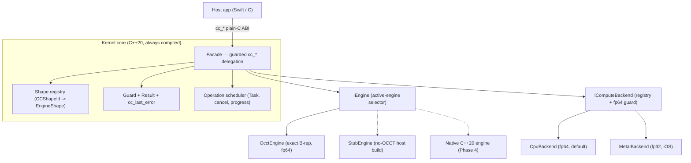

# Architecture

CyberCadKernel is layered so the geometry engine and the compute hardware are
both **pluggable behind a stable plain-C ABI**. The host app talks only to
`cc_*`; everything below it can change without breaking the app.

## Layers

## Boundaries (what may cross where)

| Boundary | Crosses it | Never crosses it |
|---|---|---|
| `cc_*` ABI (public header) | C scalars, integer `CCShapeId`, POD structs (`CCMesh`, `CCMassProps`, …) | C++ types, OCCT types, exceptions |
| `IEngine` (internal) | POD inputs, registry handles, `Result<T,Error>` | OCCT types (opaque `EngineShape` only) |
| `src/engine/occt/*.cpp` | OCCT headers/types | — (OCCT is confined here) |

**Rule:** OCCT headers appear *only* inside `src/engine/occt/*.cpp` translation
units. The public header and every shared header are OCCT-free, which is what
lets the host build compile and unit-test the whole core with a stub engine and
no OCCT present.

## Key components

### Facade (`src/facade/cc_kernel.cpp`)
Every `cc_*` is a thin, **guarded** delegation to the active engine. It owns the
process-wide shape registry and all C-buffer alloc/free helpers. An engine
`Result<T>` failure (or a thrown `std::exception` / `Standard_Failure`) collapses
to `0`/`nil` and a per-thread `cc_last_error` message — no exception ever reaches
the `extern "C"` boundary.

> The registry and active-engine singletons are **intentionally leaked** (heap,
> never deleted). Destroying the OCCT-owned `TopoDS_Shape`s during C++ static
> destruction races OCCT's own static teardown and crashes at process exit; the
> OS reclaims the memory anyway. See [STATUS-phase-0-1.md](STATUS-phase-0-1.md).

### Core (`src/core`)
- `result.h` — in-house `Result<T,Error>` (`std::expected` is C++23; the code
  targets C++20).
- `guard.*` — wraps entry points, catches exceptions, sets `cc_last_error`.
- `shape_registry.*` — thread-safe `CCShapeId` ↔ opaque `EngineShape`, `0` invalid.
- `scheduler.*` — coroutine `Task<T>` on a worker pool with cooperative
  cancellation and a progress sink. Because OCCT's `Build` is non-interruptible,
  cancellation is honoured **at the task boundary** (the result is discarded and
  resources reclaimed). Uses `std::thread` + an in-house `StopToken` because Apple
  Clang's libc++ gates `<jthread>`/`<stop_token>`.
- `compute_backend.*` — `IComputeBackend`, default `CpuBackend`, a registry, and a
  **precision guard** that refuses to dispatch fp64 work to an fp32-only backend.

### Engine adapter (`src/engine`)
`IEngine` is the internal geometry interface, grouped by capability. The
active-engine selector lets an OCCT-backed and a native implementation coexist so
each migration can be measured behind the same facade call.

- `OcctEngine` (`src/engine/occt/*`) — the exact B-rep engine. Split by capability
  group: construct, feature, boolean+transform, tessellate, query, exchange, plus
  the Phase-1 `parallel_policy` and the Phase-3 feature files.
- `StubEngine` — no-op engine so the no-OCCT host build links and unit-tests.

### Compute backend (`src/compute`)
- `CpuBackend` — default, fp64.
- `MetalBackend` (`src/compute/metal`, iOS only, behind `CYBERCAD_HAS_METAL`) —
  Metal device + unified-memory buffers + runtime MSL compilation + dispatch;
  fp32 only (refuses fp64). GPU modules built on it: surface-grid evaluation,
  LBVH build + ray traversal, picking, per-vertex normals.

## Build configurations

| Config | `CYBERCAD_HAS_OCCT` | `CYBERCAD_HAS_METAL` | Engine | Purpose |
|---|---|---|---|---|
| **Host** | OFF | OFF | Stub | CPU-only build + unit tests (macOS/Linux, any C++20 clang) |
| **iOS sim/device** | ON | ON | OCCT | Real geometry; verified on the iOS simulator |

The `cc_*` ABI is identical across configs — only the engine behind it differs.

## Async & determinism

Long operations (booleans, meshing) run through the scheduler off the UI thread
and honour cooperative cancellation. Parallelism (OCCT `SetRunParallel`,
`BRepMesh` `InParallel`, Metal dispatch) is required to preserve reproducible
results; a `cc_set_parallel(0/1)` toggle exists so serial and parallel paths can
be A/B-compared. The determinism audit (serial == parallel, bit-identical) is
part of the simulator suite.
