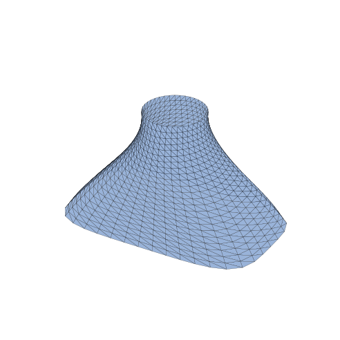
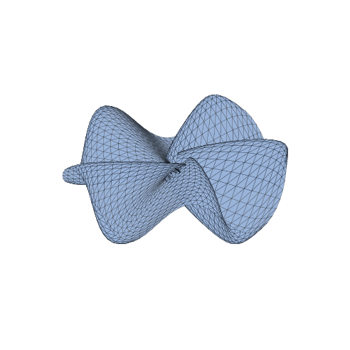
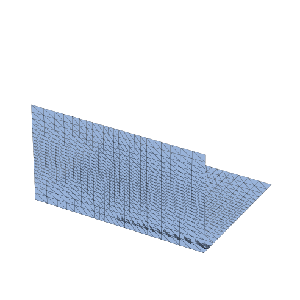
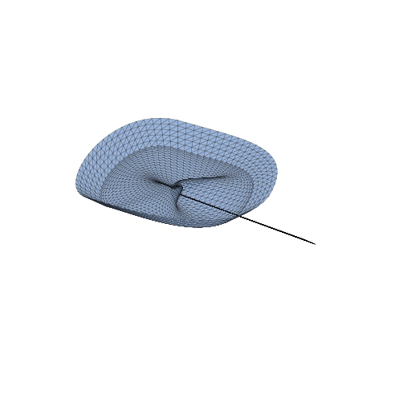
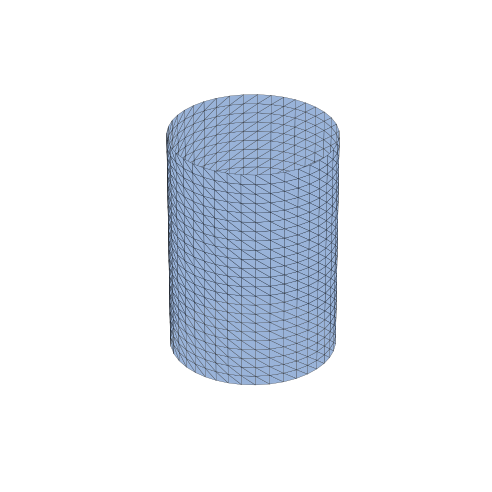
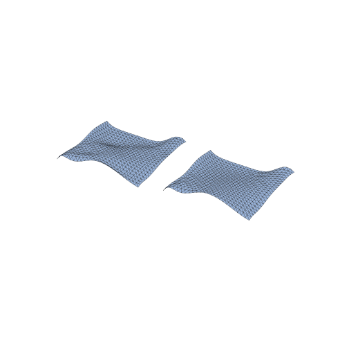
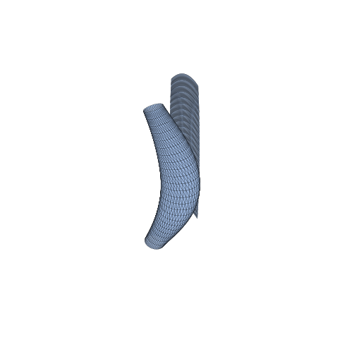
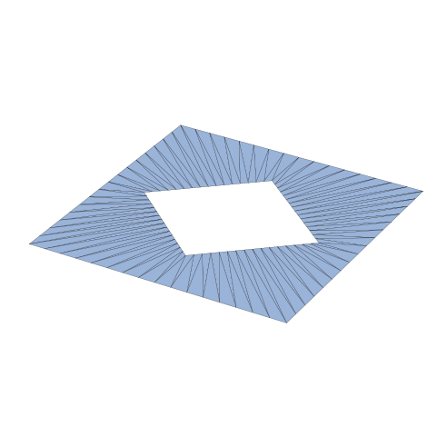
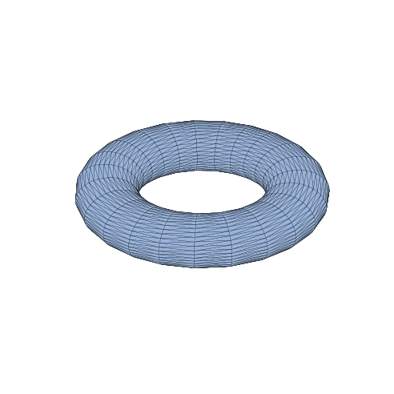

# CyberCadKernel — exact-NURBS example gallery (Wave J7)

Mechanical-piece examples that each exercise one exact-NURBS feature family through the `cybercadkernel.nurbs` Python API (the ergonomic layer over the additive `cc_nurbs_*` C facade) and render a validated PNG. These are a *consumer* gallery: no C ABI or Python package internals are modified.

## How to build

```sh
# Build the real-engine dylib with the numsci substrate on
cmake -S . -B build-mac -DCMAKE_BUILD_TYPE=Release \
  -DCYBERCAD_MACOS_OCCT=ON -DCYBERCAD_HAS_NUMSCI=ON \
  -DCYBERCAD_NUMSCI_DIR=<build-numsci output> \
  -DCYBERCAD_NUMPP_DIR=<NumPP> -DCYBERCAD_SCIPP_DIR=<SciPP>
cmake --build build-mac --target cybercadkernel

export CYBERCADKERNEL_DYLIB="$PWD/build-mac/libcybercadkernel.dylib"
python3 examples/run_all_nurbs.py     # or any examples/n*_*.py directly
```

## Display-tessellation caveat

`Surface.tessellate()` produces a **single-surface display mesh**. A single surface is **real exact geometry** (a full-turn revolved ring or the detected cylinder tessellates watertight). A piece assembled from **several** surfaces (a fillet band plus its host faces, the sub-patches of an N-sided fill or a vertex blend) is an honest **face-set** — shown together, *not* sewn into a watertight solid. Each piece below states which it is.

## Thumbnails

<p><a href="#n1_lofted_bracket"></a> <a href="#n2_nsided_boss"></a> <a href="#n3_filleted_freeform_boss"></a> <a href="#n4_chamfer_vertex_blend"></a> <a href="#n5_reverse_engineered_primitive"></a> <a href="#n6_faired_scan_patch"></a> <a href="#n7_variable_swept_handle"></a> <a href="#n8_trim_boolean_pocket"></a> <a href="#n9_revolved_rational"></a></p>

## Pieces

### <a name="n1_lofted_bracket"></a>1. Lofted bracket transition


A skinned transition bracket: a wide rounded-rectangle mouth lofted through intermediate sections up to a small round spout — one tensor-product surface containing every section as an iso-curve.

- **Feature exercised:** `cc_nurbs_skin (loft over section curves; gordon sibling)`
- **API calls:** `nurbs.interp_curve`, `nurbs.skin`, `Surface.tessellate`
- **Geometry:** single surface — **real geometry** · 1 surface(s)
- **Display mesh:** 960 verts / 1794 tris · bbox 40.0 × 24.0 × 30.0
- **Artifacts:** [PNG](out/n1_lofted_bracket/n1_lofted_bracket.png) (rendered via matplotlib)
- **Script:** [`n1_lofted_bracket.py`](n1_lofted_bracket.py)

### <a name="n2_nsided_boss"></a>2. N-sided boss cap (G2)


A 5-sided boss cap filled by an N-sided fill in G2 mode: five domed boundary curves close a pentagonal rim, and the fill returns a fan of 5 curvature-continuous patches meeting at a central star point.

- **Feature exercised:** `cc_nurbs_nsided_fill (mode G2, pentagon boundary)`
- **API calls:** `Curve.create`, `nurbs.nsided_fill`, `Surface.tessellate`
- **Geometry:** **face-set** (display; not sewn watertight) · 5 surface(s)
- **Display mesh:** 2880 verts / 5290 tris · bbox 25.8 × 25.6 × 10.6
- **Artifacts:** [PNG](out/n2_nsided_boss/n2_nsided_boss.png) (rendered via matplotlib)
- **Script:** [`n2_nsided_boss.py`](n2_nsided_boss.py)

### <a name="n3_filleted_freeform_boss"></a>3. Filleted freeform boss (G2 rolling-ball fillet)


A G2 rolling-ball fillet blends a freeform floor into a freeform wall across their concave dihedral. Shown as a face-set of floor + wall + fillet band; each is exact geometry, the ball radius is 0.3.

- **Feature exercised:** `cc_nurbs_fillet_freeform_g2 (freeform G2 fillet)`
- **API calls:** `Surface.create`, `nurbs.fillet_freeform_g2`, `Surface.tessellate`
- **Geometry:** **face-set** (display; not sewn watertight) · 3 surface(s)
- **Display mesh:** 2112 verts / 3910 tris · bbox 4.0 × 3.0 × 3.0
- **Artifacts:** [PNG](out/n3_filleted_freeform_boss/n3_filleted_freeform_boss.png) (rendered via matplotlib)
- **Script:** [`n3_filleted_freeform_boss.py`](n3_filleted_freeform_boss.py)

### <a name="n4_chamfer_vertex_blend"></a>4. Chamfered edge + vertex-blended corner


A variable-distance analytic chamfer along a plane/plane edge (setback tapering 0.4 -> 1.0), plus a setback vertex blend filling the 3-sided corner where three fillet bands meet (3 G1 corner sub-patches). Shown as a face-set; each surface is exact geometry.

- **Feature exercised:** `cc_nurbs_chamfer_variable + cc_nurbs_vertex_blend`
- **API calls:** `nurbs.chamfer_variable`, `Surface.create`, `nurbs.vertex_blend`, `Surface.tessellate`
- **Geometry:** **face-set** (display; not sewn watertight) · 7 surface(s)
- **Display mesh:** 3120 verts / 5658 tris · bbox 9.7 × 7.6 × 2.3
- **Artifacts:** [PNG](out/n4_chamfer_vertex_blend/n4_chamfer_vertex_blend.png) (rendered via matplotlib)
- **Script:** [`n4_chamfer_vertex_blend.py`](n4_chamfer_vertex_blend.py)

### <a name="n5_reverse_engineered_primitive"></a>5. Reverse-engineered cylinder (from a point cloud)


A noisy point cloud sampled off a radius-8 cylinder is run through detect_primitive, which recovers CYLINDER (radius 7.997, RMS 0.0498); the recovered parameters rebuild the EXACT rational cylinder shown here.

- **Feature exercised:** `cc_nurbs_detect_primitive (-> exact cc_nurbs_cylinder)`
- **API calls:** `nurbs.detect_primitive`, `nurbs.cylinder`, `Surface.tessellate`
- **Geometry:** single surface — **real geometry** · 1 surface(s)
- **Display mesh:** 960 verts / 1794 tris · bbox 16.0 × 16.0 × 30.0
- **Artifacts:** [PNG](out/n5_reverse_engineered_primitive/n5_reverse_engineered_primitive.png) (rendered via matplotlib)
- **Script:** [`n5_reverse_engineered_primitive.py`](n5_reverse_engineered_primitive.py)

### <a name="n6_faired_scan_patch"></a>6. Faired scan patch (before / after)


A noisy scan grid is fitted to a NURBS surface (left, raw) then smoothed by a minimal-energy thin-plate fairing within tolerance (right, faired). The two single-surface patches are shown side by side to make the noise damping visible.

- **Feature exercised:** `cc_nurbs_fair_surface (over cc_nurbs_fit_surface)`
- **API calls:** `nurbs.fit_surface`, `nurbs.fair_surface`, `Surface.tessellate`
- **Geometry:** **face-set** (display; not sewn watertight) · 2 surface(s)
- **Display mesh:** 1152 verts / 2116 tris · bbox 46.0 × 20.0 × 6.0
- **Artifacts:** [PNG](out/n6_faired_scan_patch/n6_faired_scan_patch.png) (rendered via matplotlib)
- **Script:** [`n6_faired_scan_patch.py`](n6_faired_scan_patch.py)

### <a name="n7_variable_swept_handle"></a>7. Variable-section swept handle


A round grip swept along a bowed path with a per-station scale (bulging mid-grip, necking at the ends) and twist, plus a two-rail-swept spine bar whose section rides two rail curves. Both sweep flavours in one piece.

- **Feature exercised:** `cc_nurbs_sweep_variable + cc_nurbs_sweep_two_rail`
- **API calls:** `nurbs.circle`, `nurbs.interp_curve`, `nurbs.sweep_variable`, `nurbs.sweep_two_rail`, `Surface.tessellate`
- **Geometry:** **face-set** (display; not sewn watertight) · 2 surface(s)
- **Display mesh:** 1920 verts / 3588 tris · bbox 13.1 × 15.7 × 43.3
- **Artifacts:** [PNG](out/n7_variable_swept_handle/n7_variable_swept_handle.png) (rendered via matplotlib)
- **Script:** [`n7_variable_swept_handle.py`](n7_variable_swept_handle.py)

### <a name="n8_trim_boolean_pocket"></a>8. Trim-boolean pocket


A rectangular face with a diamond pocket cut by a parameter-space trim boolean: DIFFERENCE (area 12.6) subtracts the pocket, INTERSECTION reports area 3.4. The result region — outer loop minus the hole loop — is mapped onto the host plane and shown as the trimmed result face.

- **Feature exercised:** `cc_nurbs_trim_region_boolean (DIFFERENCE / INTERSECT)`
- **API calls:** `Curve.create`, `nurbs.trim_region_boolean`, `nurbs.plane`, `Surface.eval`
- **Geometry:** single surface — **real geometry** · 1 surface(s)
- **Display mesh:** 128 verts / 128 tris · bbox 4.0 × 4.0 × 0.0
- **Artifacts:** [PNG](out/n8_trim_boolean_pocket/n8_trim_boolean_pocket.png) (rendered via matplotlib)
- **Script:** [`n8_trim_boolean_pocket.py`](n8_trim_boolean_pocket.py)

### <a name="n9_revolved_rational"></a>9. Revolved rational ring


An off-axis circle revolved a full turn about the z-axis by nurbs.revolve, yielding an EXACT rational surface of revolution (a torus-like ring). rational=True; a full-turn revolve of a closed profile tessellates watertight — the single-surface case that IS a sewn solid.

- **Feature exercised:** `cc_nurbs_revolve (exact rational surface of revolution)`
- **API calls:** `nurbs.circle`, `nurbs.revolve`, `Surface.tessellate`
- **Geometry:** single surface — **real geometry** · 1 surface(s)
- **Display mesh:** 960 verts / 1794 tris · bbox 31.9 × 31.9 × 8.0
- **Artifacts:** [PNG](out/n9_revolved_rational/n9_revolved_rational.png) (rendered via matplotlib)
- **Script:** [`n9_revolved_rational.py`](n9_revolved_rational.py)

---

_Generated by `examples/run_all_nurbs.py`. The B-rep (`Kernel`/`Shape`) gallery is separate — see [`README.md`](README.md)._
