# CyberCadKernel — mechanical example gallery

Parametric mechanical CAD pieces built through the CyberCadKernel Python binding (`python/cybercadkernel`), on the real OCCT-backed engine. Every piece is a genuine B-rep solid: the volumes and bounding boxes below come from the kernel's exact mass-property query, not the mesh.

> **Two galleries here.** This page is the B-rep (`Kernel` / `Shape`) gallery. There is a companion **exact-NURBS gallery** — [`GALLERY.md`](GALLERY.md) — that drives the `cybercadkernel.nurbs` layer (the `Curve` / `Surface` handles over the `cc_nurbs_*` C facade): a skinned bracket, a G2 N-sided boss cap, a freeform-G2-filleted boss, a chamfered + vertex-blended corner, a reverse-engineered cylinder, a faired scan patch, a variable-section swept handle, a trim-boolean pocket, and a revolved rational ring. Build those nine with `python3 examples/run_all_nurbs.py` (or any `examples/n*_*.py` directly).

## How to build

```sh
# 1. Build the real-engine dylib (Homebrew OCCT at /opt/homebrew/opt/opencascade)
CLEAN=1 bash scripts/build-macos-dylib.sh

# 2. Point the binding at it and regenerate the whole gallery
export CYBERCADKERNEL_DYLIB="$PWD/build-mac/libcybercadkernel.dylib"
python3 examples/run_all.py
```

Each script is self-contained (`python3 examples/01_pipe_flange.py`) with its parametric constants at the top and a `build(kernel)` returning the `Shape`. Artifacts land in `examples/out/<name>/`: a STEP model, a binary STL, a glTF (`.glb`) and a PNG thumbnail.

## Pieces

### Pipe flange (6-bolt raised face)

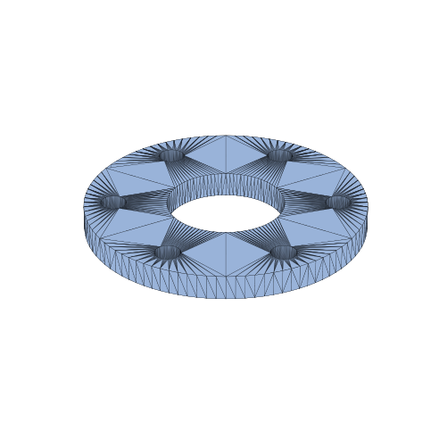

Round flange: a thick disc with a central pipe bore and a 6-hole bolt circle, outer rim filleted.

- **Features:** extruded discs, boolean cut, circular hole pattern, edge fillet
- **Volume:** 122,776.8 mm³ · **Surface area:** 27,917.5 mm²
- **Bounding box:** 120.0 × 120.0 × 14.0 mm
- **Artifacts:** [STEP](out/01_pipe_flange/01_pipe_flange.step) · [STL](out/01_pipe_flange/01_pipe_flange.stl) · [GLB](out/01_pipe_flange/01_pipe_flange.glb) · [PNG](out/01_pipe_flange/01_pipe_flange.png)
- **Script:** [`01_pipe_flange.py`](01_pipe_flange.py)

### L-bracket with gusset

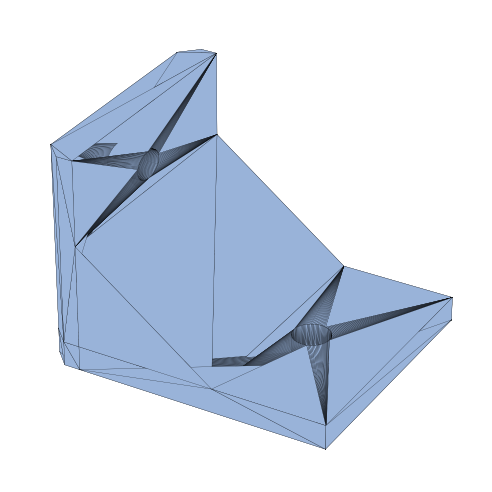

Right-angle mounting bracket: two plates fused with a triangular gusset, a mounting hole per flange, filleted inner corner, chamfered outer edges.

- **Features:** boolean fuse, boolean cut, edge fillet, edge chamfer
- **Volume:** 95,902.9 mm³ · **Surface area:** 18,711.0 mm²
- **Bounding box:** 70.0 × 60.0 × 70.0 mm
- **Artifacts:** [STEP](out/02_l_bracket/02_l_bracket.step) · [STL](out/02_l_bracket/02_l_bracket.stl) · [GLB](out/02_l_bracket/02_l_bracket.glb) · [PNG](out/02_l_bracket/02_l_bracket.png)
- **Script:** [`02_l_bracket.py`](02_l_bracket.py)

### Pillow-block bearing housing

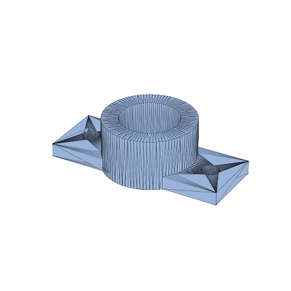

Bearing housing: a slotted base plate carrying a bored cylindrical boss (bearing seat with a back wall) and a filleted boss rim.

- **Features:** box + cylinder, boolean fuse/cut, bored seat, edge fillet
- **Volume:** 116,971.0 mm³ · **Surface area:** 28,031.9 mm²
- **Bounding box:** 120.0 × 62.0 × 46.0 mm
- **Artifacts:** [STEP](out/03_bearing_block/03_bearing_block.step) · [STL](out/03_bearing_block/03_bearing_block.stl) · [GLB](out/03_bearing_block/03_bearing_block.glb) · [PNG](out/03_bearing_block/03_bearing_block.png)
- **Script:** [`03_bearing_block.py`](03_bearing_block.py)

### V-belt pulley (single groove)

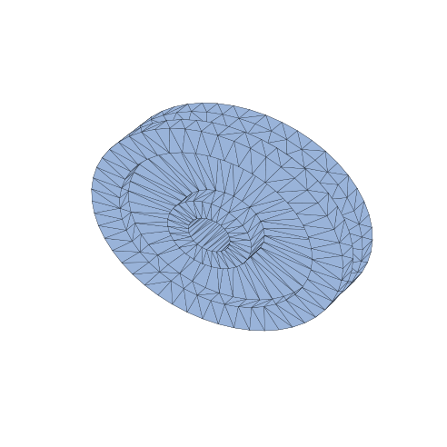

Single-groove V-belt pulley revolved from one cross-section: bored hub, thin web, and a rim carrying a symmetric ~38 deg V-groove.

- **Features:** revolve (hand-built profile), integral bore, V-groove section
- **Volume:** 200,504.9 mm³ · **Surface area:** 46,237.0 mm²
- **Bounding box:** 120.0 × 34.0 × 120.0 mm
- **Artifacts:** [STEP](out/04_v_pulley/04_v_pulley.step) · [STL](out/04_v_pulley/04_v_pulley.stl) · [GLB](out/04_v_pulley/04_v_pulley.glb) · [PNG](out/04_v_pulley/04_v_pulley.png)
- **Script:** [`04_v_pulley.py`](04_v_pulley.py)

### Shelled electronics enclosure

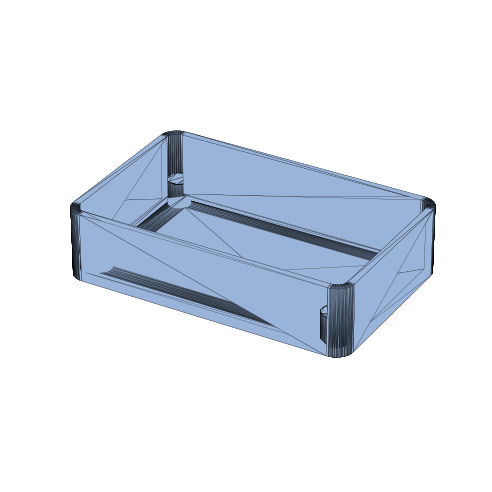

Rounded-corner enclosure hollowed to a 2.4 mm wall (open top), with filleted outer edges and four internal lid-locating bosses.

- **Features:** rounded-rect extrude, shell, edge fillet, boolean fuse (bosses)
- **Volume:** 39,719.1 mm³ · **Surface area:** 33,058.4 mm²
- **Bounding box:** 100.0 × 64.0 × 32.0 mm
- **Artifacts:** [STEP](out/05_enclosure/05_enclosure.step) · [STL](out/05_enclosure/05_enclosure.stl) · [GLB](out/05_enclosure/05_enclosure.glb) · [PNG](out/05_enclosure/05_enclosure.png)
- **Script:** [`05_enclosure.py`](05_enclosure.py)

### Spur gear (simplified, 20 teeth)

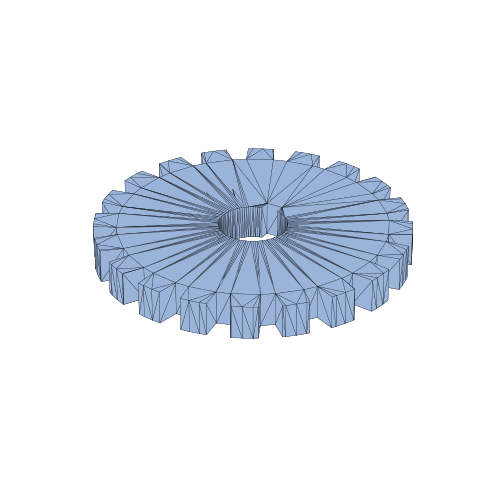

Stylised 20-tooth spur gear: a blank with a circular array of trapezoidal tooth-gap cuts, a central bore and a keyway. Not a true involute profile.

- **Features:** cylinder primitive, circular boolean pattern, boolean cut (bore + keyway)
- **Volume:** 127,711.8 mm³ · **Surface area:** 26,906.4 mm²
- **Bounding box:** 109.7 × 109.7 × 16.0 mm
- **Artifacts:** [STEP](out/06_spur_gear_simplified/06_spur_gear_simplified.step) · [STL](out/06_spur_gear_simplified/06_spur_gear_simplified.stl) · [GLB](out/06_spur_gear_simplified/06_spur_gear_simplified.glb) · [PNG](out/06_spur_gear_simplified/06_spur_gear_simplified.png)
- **Script:** [`06_spur_gear_simplified.py`](06_spur_gear_simplified.py)

### Hydraulic manifold block

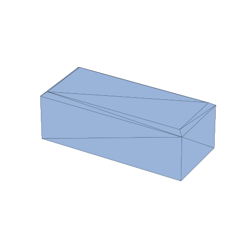

Manifold block with a through horizontal gallery, two vertical ports that intersect it internally, four corner mounting holes and a chamfered top rim.

- **Features:** box primitive, intersecting cross-drillings, corner hole pattern, edge chamfer
- **Volume:** 142,866.0 mm³ · **Surface area:** 17,128.2 mm²
- **Bounding box:** 90.0 × 40.0 × 40.0 mm
- **Artifacts:** [STEP](out/07_manifold_block/07_manifold_block.step) · [STL](out/07_manifold_block/07_manifold_block.stl) · [GLB](out/07_manifold_block/07_manifold_block.glb) · [PNG](out/07_manifold_block/07_manifold_block.png)
- **Script:** [`07_manifold_block.py`](07_manifold_block.py)

### Round-to-square duct adapter

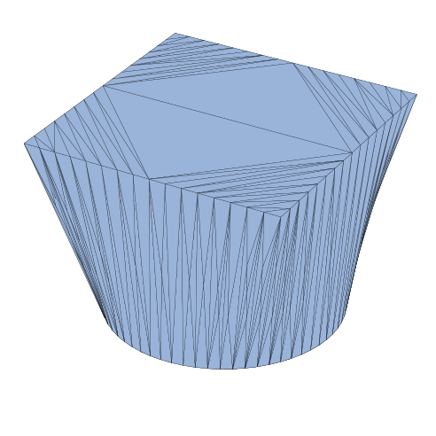

HVAC transition lofting an 80 mm round inlet into a 90 mm square outlet over a 90 mm rise, then shelled to a 3 mm wall (both ends open) for real ducting.

- **Features:** loft (circle -> square), shell (open both ends)
- **Volume:** 587,866.4 mm³ · **Surface area:** 40,383.7 mm²
- **Bounding box:** 90.0 × 90.0 × 90.0 mm
- **Artifacts:** [STEP](out/08_round_square_adapter/08_round_square_adapter.step) · [STL](out/08_round_square_adapter/08_round_square_adapter.stl) · [GLB](out/08_round_square_adapter/08_round_square_adapter.glb) · [PNG](out/08_round_square_adapter/08_round_square_adapter.png)
- **Script:** [`08_round_square_adapter.py`](08_round_square_adapter.py)

### Swept coolant tube (S-bend)

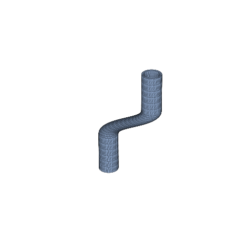

A 22 mm coolant line swept along an S-bend: a round section carried by a guide-steered sweep, with an inner bore swept and cut away to leave a constant 2.5 mm wall.

- **Features:** sweep along S-bend path, boolean cut (swept bore)
- **Volume:** 27,488.8 mm³ · **Surface area:** 23,898.8 mm²
- **Bounding box:** 77.0 × 22.0 × 180.0 mm
- **Artifacts:** [STEP](out/09_coolant_tube/09_coolant_tube.step) · [STL](out/09_coolant_tube/09_coolant_tube.stl) · [GLB](out/09_coolant_tube/09_coolant_tube.glb) · [PNG](out/09_coolant_tube/09_coolant_tube.png)
- **Script:** [`09_coolant_tube.py`](09_coolant_tube.py)

### Threaded hex bolt

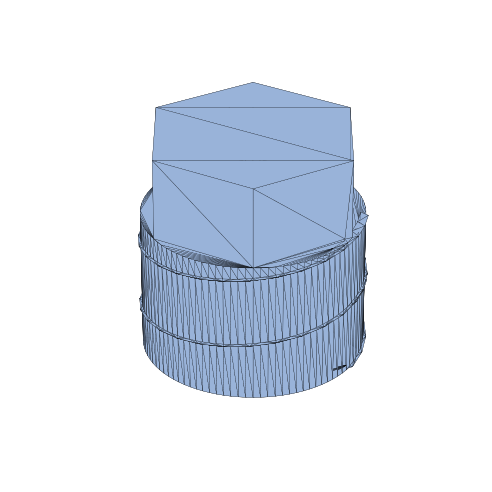

A regular-hexagon head fused onto a cylindrical shank, then a real helical thread welded onto the blank by the robust per-turn thread-boolean (thread_apply FUSE) — one valid B-rep solid.

- **Features:** extrude (hex head), boolean fuse, helical thread, thread_apply fuse
- **Volume:** 55,998.0 mm³ · **Surface area:** 8,632.4 mm²
- **Bounding box:** 39.0 × 39.0 × 53.7 mm
- **Artifacts:** [STEP](out/10_threaded_bolt/10_threaded_bolt.step) · [STL](out/10_threaded_bolt/10_threaded_bolt.stl) · [GLB](out/10_threaded_bolt/10_threaded_bolt.glb) · [PNG](out/10_threaded_bolt/10_threaded_bolt.png)
- **Script:** [`10_threaded_bolt.py`](10_threaded_bolt.py)

### Sheet-metal L-bracket (folded)

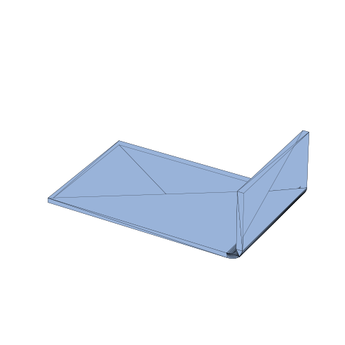

A 2 mm sheet-metal bracket: a flat base flange with one 90° edge flange bent up off a straight rim (3 mm inside bend radius). Native sheet-metal ops.

- **Features:** sheet base flange, sheet edge flange (90° bend)
- **Volume:** 7,302.0 mm³ · **Surface area:** 7,827.6 mm²
- **Bounding box:** 65.0 × 40.0 × 30.0 mm
- **Artifacts:** [STEP](out/11a_sheet_bracket_folded/11a_sheet_bracket_folded.step) · [STL](out/11a_sheet_bracket_folded/11a_sheet_bracket_folded.stl) · [GLB](out/11a_sheet_bracket_folded/11a_sheet_bracket_folded.glb) · [PNG](out/11a_sheet_bracket_folded/11a_sheet_bracket_folded.png)
- **Script:** [`11a_sheet_bracket_folded.py`](11a_sheet_bracket_folded.py)

### Sheet-metal L-bracket (flat pattern)

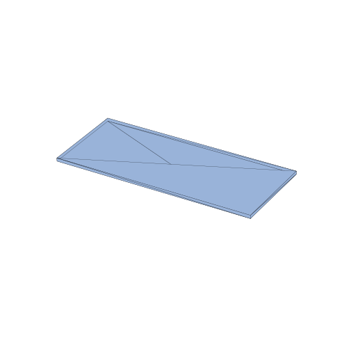

The developed flat blank of the folded bracket, produced by unfolding the bend (k-factor 0.4). Plan area = (base run + bend allowance + wall) × width, conserved through fold ↔ unfold — so the flat blank is strictly larger in plan than the base flange. Fold→unfold volume: 7,302 → 7,278 mm³ (0.3% bend-allowance model difference).

- **Features:** sheet base flange, sheet edge flange, sheet unfold (flat pattern)
- **Volume:** 7,277.5 mm³ · **Surface area:** 7,801.4 mm²
- **Bounding box:** 91.0 × 40.0 × 2.0 mm
- **Artifacts:** [STEP](out/11b_sheet_bracket_flat/11b_sheet_bracket_flat.step) · [STL](out/11b_sheet_bracket_flat/11b_sheet_bracket_flat.stl) · [GLB](out/11b_sheet_bracket_flat/11b_sheet_bracket_flat.glb) · [PNG](out/11b_sheet_bracket_flat/11b_sheet_bracket_flat.png)
- **Script:** [`11b_sheet_bracket_flat.py`](11b_sheet_bracket_flat.py)

### Draft-moulded housing

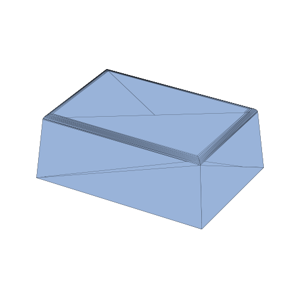

An injection-mould-style cover: a rectangular boss with 4° draft on all four side walls (pull +Z, neutral at the base), shelled to a 2.5 mm wall (open bottom) with a filleted top rim.

- **Features:** draft faces (4° side walls), shell (open bottom), edge fillet (top rim)
- **Volume:** 32,663.9 mm³ · **Surface area:** 26,854.9 mm²
- **Bounding box:** 80.0 × 56.0 × 40.0 mm
- **Artifacts:** [STEP](out/12_draft_housing/12_draft_housing.step) · [STL](out/12_draft_housing/12_draft_housing.stl) · [GLB](out/12_draft_housing/12_draft_housing.glb) · [PNG](out/12_draft_housing/12_draft_housing.png)
- **Script:** [`12_draft_housing.py`](12_draft_housing.py)

### Section + HLR engineering drawing

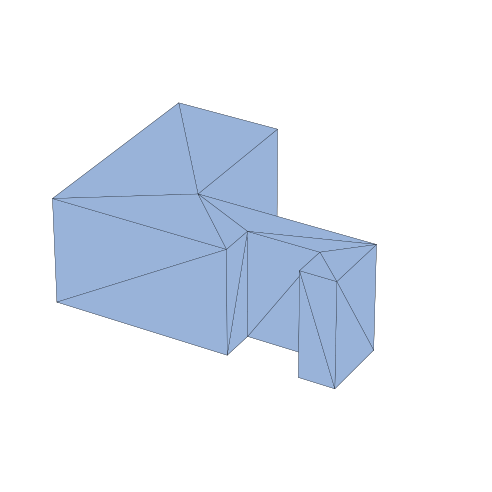

A machined step-block (L-profile prism with a rectangular notch) rendered as a real orthographic drawing: a planar section (area/perimeter in the caption) plus front/top/right HLR views and an isometric — visible edges solid, hidden edges dashed. See the drawing PNG artifact. Section @ Z=20: 1 loop, area 2,600 mm², perimeter 300 mm. HLR edge counts (visible/hidden): front 7/13, top 10/10, right 4/16, iso 18/14.

- **Features:** planar section, HLR projection (multi-view drawing)
- **Volume:** 104,000.0 mm³ · **Surface area:** 17,200.0 mm²
- **Bounding box:** 80.0 × 60.0 × 40.0 mm
- **Artifacts:** [STEP](out/13_section_hlr_drawing/13_section_hlr_drawing.step) · [STL](out/13_section_hlr_drawing/13_section_hlr_drawing.stl) · [GLB](out/13_section_hlr_drawing/13_section_hlr_drawing.glb) · [PNG](out/13_section_hlr_drawing/13_section_hlr_drawing.png) · [DRAWING](out/13_section_hlr_drawing/13_section_hlr_drawing_drawing.png)
- **Script:** [`13_section_hlr_drawing.py`](13_section_hlr_drawing.py)

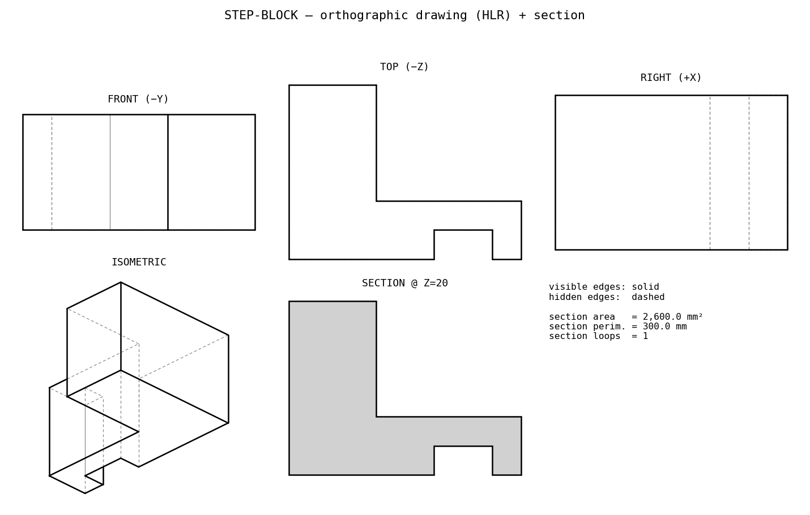

## Rendering

Thumbnails are rendered offscreen by `cybercadkernel.viz.render_png`, which tries the trimesh OpenGL path first and falls back to a headless matplotlib rasterizer. In this run the renders resolved via: **matplotlib**.

## Feature-rich pieces & the engine split

Pieces 08–13 exercise the ops the completed binding unlocks — loft, sweep, helical threads, sheet-metal, draft and 2-D section/HLR drawings. Most run on the default **OCCT** engine. A few ops are provided only by the **native** engine (sheet-metal base/edge flange + unfold, and planar section curves); those pieces build *and* consume every body entirely under the native engine — no body is ever handed across engines — so the known cross-engine hazard is never touched. The section/HLR showpiece runs HLR under OCCT (true B-rep feature edges, a clean drawing) and rebuilds the identical planar solid under native only to compute the section.

Two engine behaviours worth noting for anyone reusing these ops: `helical_thread` sizes the thread by `majorRadius × pointsPerMM` (the size args are proportions, not literal mm) and its crest radius is best *measured* back from the result; and `thread_apply` output is display-valid but boolean-hostile, so fuse the head onto the shank **before** threading.

